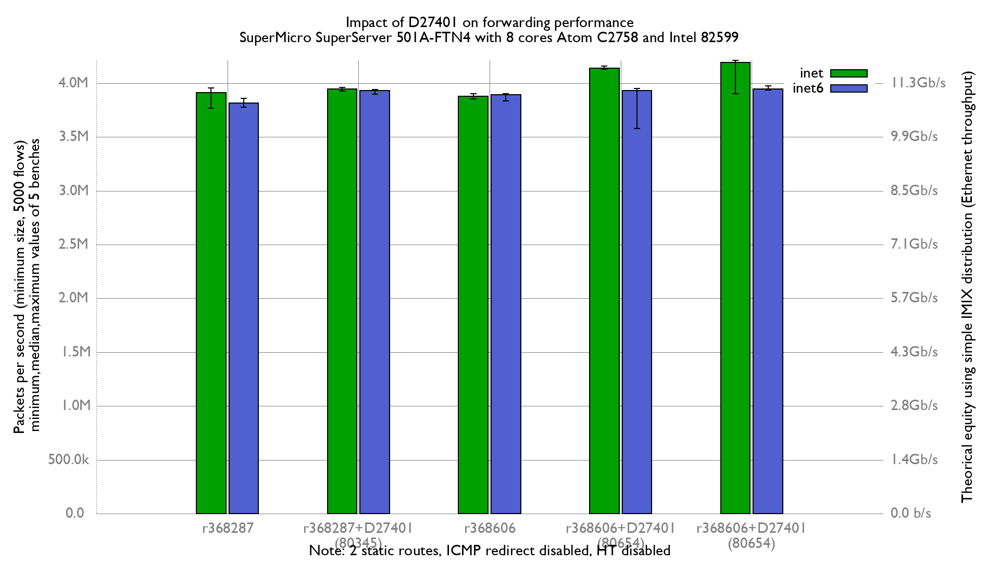

Impact of enabling firewalls on BSDRP 1.90 (FreeBSD 11.2-BETA3) forwarding performance
  - SuperMicro SuperServer 5018A-FTN4 (8 cores Atom C2758 at 2.4GHz)
  - Intel 82599 10G
  - Quad port Chelsio 10-Gigabit T540-CR (10Giga DAC cable)
  - 5000 flows of smallest UDP packets
  - 2 static routes
  - harvest.mask=351
  - ICMP redirect disabled
  - Traffic load at 14.88 Mpps



IPv4:
```
x r368287: inet packets-per-second forwarded
+ r368287 with D27401(diff 80345): inet packets-per-second forwarded
* r368606: inet packets-per-second forwarded
% r368606 with D27401(diff 80654): inet packets-per-second forwarded
# r368606 with D27401(diff 80677): inet packets-per-second forwarded
+--------------------------------------------------------------------------+
|                *    x +  +                           %       #           |
|x           *   * * Ox + x+x+                        %%% %   ##  #        |
|        |__________A_M________|                                           |
|                       |_AM_|                                             |
|              |_A__|                                                      |
|                                                     |MA|                 |
|                                   |__________________A_______M__________||
+--------------------------------------------------------------------------+
    N           Min           Max        Median           Avg        Stddev
x   5       3767761     3953285.5       3911606     3895897.9      74078.27
+   5       3925328       3961420       3946868       3941849     15473.869
No difference proven at 95.0% confidence
*   5       3851624       3901648       3878680     3880508.4     19001.987
No difference proven at 95.0% confidence
%   5       4131110       4158054       4137767     4142044.4     10505.243
Difference at 95.0% confidence
	246146 +/- 77159.4
	6.31809% +/- 2.10327%
	(Student's t, pooled s = 52905.3)
#   5       3903801       4211186       4191704     4136498.6     130487.88
Difference at 95.0% confidence
	240601 +/- 154742
	6.17574% +/- 4.03307%
	(Student's t, pooled s = 106101)
```

IPv6:
```
x r368287: inet6 packets-per-second forwarded
+ r368287 with D27401(diff 80345): inet6 packets-per-second forwarded
* r368606: inet6 packets-per-second forwarded
% r368606 with D27401(diff 80654): inet6 packets-per-second forwarded
# r368606 with D27401(diff 80677): inet6 packets-per-second forwarded
+--------------------------------------------------------------------------+
|                                      x            * *   %O #             |
|%                               x     xx *    x    *+*   @O@#   #         |
|                                  |___MA___|                              |
|                                                      |__AM|              |
|                                             |____AM___|                  |
|                     |_________________________A_________M_______________||
|                                                          |_A_|           |
+--------------------------------------------------------------------------+
    N           Min           Max        Median           Avg        Stddev
x   5       3776037       3860133       3813923     3815261.8     29928.979
+   5       3896818       3940756       3932902     3926365.9     17218.134
Difference at 95.0% confidence
	111104 +/- 35608.2
	2.9121% +/- 0.953803%
	(Student's t, pooled s = 24415.2)
*   5       3832319       3903764       3892201     3884094.4     29684.245
Difference at 95.0% confidence
	68832.6 +/- 43471.6
	1.80414% +/- 1.14982%
	(Student's t, pooled s = 29806.9)
%   5       3576197       3949365       3931435     3865729.4     162050.89
No difference proven at 95.0% confidence
#   5       3935232       3971922       3945443     3947185.4     14624.537
Difference at 95.0% confidence
	131924 +/- 34352.8
	3.45779% +/- 0.925618%
	(Student's t, pooled s = 23554.4)
```

Flamegraphs:
- [r368287: inet4](bench.r368287.inet4.svg)
- [r368287 with D27401(diff 80345): inet4](bench.r368287D27401v2.inet4.svg)
- [r368606: inet4](bench.r368606.inet4.svg)
- [r368606 with D27401(diff 80654): inet4](bench.r368606D27401v3.inet4.svg)
- [r368606 with D27401(diff 80677): inet4](bench.r368606D27401v4.inet4.svg)
- [r368287: inet6](bench.r368287.inet6.svg)
- [r368287 with D27401(diff 80345): inet6](bench.r368287D27401v2.inet6.svg)
- [r368606: inet6](bench.r368606.inet6.svg)
- [r368606 with D27401(diff 80654): inet6](bench.r368606D27401v3.inet6.svg)
- [r368606 with D27401(diff 80677): inet6](bench.r368606D27401v4.inet6.svg)
