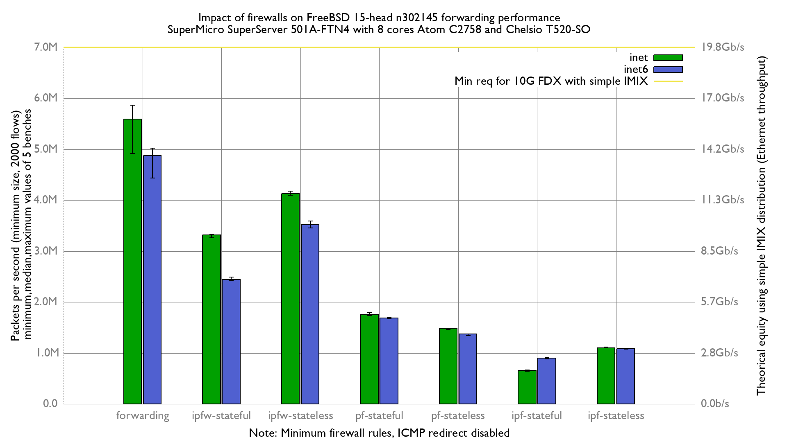

# Impact of firewalls on forwarding performance
Lab:
  - SuperMicro SuperServer 5018A-FTN4 (8 cores Atom C2758 at 2.4GHz)
  - Chelsio T520-SO
  - FreeBSD 15-head n302145 (e69573bc2be)
  - 2000 flows of smallest UDP packets
  - 2 static routes
  - Traffic load at 14.8 Mpps
  - harvest.mask=351
  - net.inet.ip.redirect=0
  - net.inet6.ip6.redirect=0

# Results

## Graph



## flamegraphs

### inet

  - [forwarding: inet](bench.forwarding.inet4.svg)
  - [ipfw-stateless: inet](bench.ipfw-stateless.inet4.svg)
  - [ipfw-stateful: inet](bench.ipfw-stateful.inet4.svg)
  - [pf-stateful: inet](bench.pf-stateful.inet4.svg)
  - [pf-stateless: inet](bench.pf-stateless.inet4.svg)
  - [ipf-stateless: inet](bench.ipf-stateless.inet4.svg)
  - [ipf-stateful: inet](bench.ipf-stateful.inet4.svg)

## inet6

  - [forwarding: inet6](bench.forwarding.inet6.svg)
  - [ipfw-stateless: inet6](bench.ipfw-stateless.inet6.svg)
  - [ipfw-stateful: inet6](bench.ipfw-stateful.inet6.svg)
  - [pf-stateless: inet6](bench.pf-stateless.inet6.svg)
  - [pf-stateful: inet6](bench.pf-stateful.inet6.svg)
  - [ipf-stateless: inet6](bench.ipf-stateful.inet6.svg)
  - [ipf-stateful: inet6](bench.ipf-stateless.inet6.svg)

## ministat

### inet

Unit: packets-per-second forwarded
```
x forwarding.inet4.pps
+ ipf-stateful.inet4.pps
* ipf-stateless.inet4.pps
% ipfw-stateful.inet4.pps
# ipfw-stateless.inet4.pps
@ pf-stateful.inet4.pps
O pf-stateless.inet4.pps
+--------------------------------------------------------------------------+
|                  O  @                                                    |
|+      *          O  @                  %          #                      |
|+      *          O  @                  %          #                      |
|+      *          O  @                  %          #                    xx|
|+      *          O  @                  %         ##                   xxx|
|                                                                        A||
|A                                                                         |
|       A|                                                                 |
|                                        A                                 |
|                                                  |A                      |
|                     A                                                    |
|                  A                                                       |
+--------------------------------------------------------------------------+
    N           Min           Max        Median           Avg        Stddev
x   5       4398620       4477773       4449011     4447432.9     30662.535
+   5      661852.5      679463.5      673347.5      671287.4      7837.302
Difference at 95.0% confidence
	-3.77615e+06 +/- 32638.1
	-84.9062% +/- 0.211054%
	(Student's t, pooled s = 22378.7)
*   5       1029482     1052062.5       1048303     1044491.8      9560.824
Difference at 95.0% confidence
	-3.40294e+06 +/- 33123
	-76.5147% +/- 0.277547%
	(Student's t, pooled s = 22711.2)
%   5       2748872       2767496       2761103       2761064     7535.2294
Difference at 95.0% confidence
	-1.68637e+06 +/- 32562.3
	-37.9178% +/- 0.474732%
	(Student's t, pooled s = 22326.8)
#   5     3287044.5       3343977     3313788.5     3314314.3     21317.164
Difference at 95.0% confidence
	-1.13312e+06 +/- 38512.4
	-25.478% +/- 0.724626%
	(Student's t, pooled s = 26406.6)
@   5       1739181       1764481       1756500     1753894.1      9265.767
Difference at 95.0% confidence
	-2.69354e+06 +/- 33033.7
	-60.5639% +/- 0.353246%
	(Student's t, pooled s = 22650)
O   5       1586673       1591017       1590883     1589874.7     1860.5515
Difference at 95.0% confidence
	-2.85756e+06 +/- 31679.7
	-64.2519% +/- 0.257807%
	(Student's t, pooled s = 21721.6)
```

