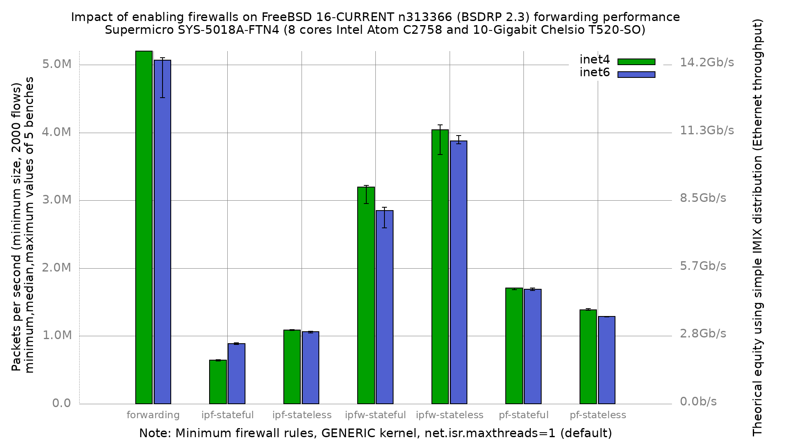

# Impact of firewalls on forwarding performance

Lab:
  - [SuperMicro SuperServer 5018A-FTN4 (8 cores Atom C2758 at 2.4GHz)](https://www.supermicro.com/en/products/system/1U/5018/SYS-5018A-FTN4.cfm)
  - Chelsio T520-SO (10-Gigabit)
  - FreeBSD 16-CURRENT n313366 (BSDRP 2.3)
  - GENERIC kernel
  - 2000 flows of smallest UDP packets
  - 2 static routes
  - Traffic load at 14.88 Mpps (10-Gigabit line rate)
  - cxgbe TOE/RDMA/iSCSI/FCoE capabilities disabled, pause frames off
  - net.isr.maxthreads=1 (default)
  - 5 iterations per data point, reboot between each

# Results

## Graph

Median values (pps):

| configuration  | inet4   | inet6   |
|----------------|---------|---------|
| forwarding     | 5555293 | 5066834 |
| ipf-stateful   | 644450  | 884726  |
| ipf-stateless  | 1086712 | 1061925 |
| ipfw-stateful  | 3195142 | 2849927 |
| ipfw-stateless | 4042203 | 3875365 |
| pf-stateful    | 1704808 | 1686950 |
| pf-stateless   | 1387331 | 1288081 |

## Observations

ipfw is by far the fastest of the three firewalls: stateless 4.04 Mpps
(27% below plain forwarding), stateful 3.20 Mpps. pf follows at 1.70/1.39
Mpps, and ipf is the slowest, with ipf-stateful at 644 Kpps — an 88% drop
from plain forwarding.

**pf-stateful is 22.9% faster than pf-stateless on inet4 and 31.0% faster
on inet6.** This is the largest such inversion in this archive, and it is
not noise: all four pf data points have spreads between 0.4% and 2.0%. The
mechanism is the one the hwpmc profiles on the Intel 82599 machine showed
directly — the `no state` ruleset is evaluated in full for every packet,
while a stateful match short-circuits on the state table.

That makes three platforms on this FreeBSD revision showing the same
inversion: the APU2 (+16.6%), the Atom with Intel 82599 (+16.6%), and this
one (+22.9%).

**ipf-stateful is again the one configuration where inet6 beats inet4**
(884726 vs 644450, +37%), as on the Intel 82599 machine (+22%). State lookup
dominates that configuration, so the larger IPv6 header stops being the
limiting factor.

## Version delta against `fbsd15-n302145`

| configuration  | n302145 inet4 | n313366 inet4 | delta | n302145 inet6 | n313366 inet6 | delta  |
|----------------|---------------|---------------|-------|---------------|---------------|--------|
| forwarding     | 5591154       | 5555293       | -0.6% | 4874362       | 5066834       | +3.9%  |
| ipf-stateful   | 655210        | 644450        | -1.6% | 903335        | 884726        | -2.1%  |
| ipf-stateless  | 1101357       | 1086712       | -1.3% | 1086437       | 1061925       | -2.3%  |
| ipfw-stateful  | 3321802       | 3195142       | -3.8% | 2439423       | 2849927       | +16.8% |
| ipfw-stateless | 4134222       | 4042203       | -2.2% | 3519196       | 3875365       | +10.1% |
| pf-stateful    | 1755894       | 1704808       | -2.9% | 1687626       | 1686950       | -0.0%  |
| pf-stateless   | 1487517       | 1387331       | -6.7% | 1373878       | 1288081       | -6.2%  |

inet4 is flat to slightly down across the board (-0.6% to -6.7%). The two
large inet6 gains, ipfw-stateful +16.8% and ipfw-stateless +10.1%, should be
read against their spreads (10.7% and 3.1% here) — part of the ipfw-stateful
figure in particular is measurement scatter rather than improvement.

### Configuration difference against that baseline

This run does **not** set `harvest_mask="351"` or `icmp_drop_redirect="YES"`,
both of which the `fbsd15-n302145` result documents. Both were removed after
being measured or read in the source:

  - `harvest_mask` was benchmarked directly on this machine, see
    [`harvest_mask`](../../../harvest_mask/results/fbsd16-n313366.BSDRP.2.3/README.md):
    **no difference proven at 95% confidence** (5542760 against 5518250 pps).
    The mask does change as intended (20959 to 16735) so the measurement is
    real; the setting simply does not pay on this kernel.
  - `icmp_drop_redirect` is redundant while forwarding: `sys/netinet/ip_icmp.c`
    skips redirect processing when `V_drop_redirect || V_ipforwarding`, and
    this DUT runs with `net.inet.ip.forwarding=1`. Measured
    `net.inet.icmp.drop_redirect=0` after a real boot, and the bench sends
    only UDP, so no redirect packets exist to process.

## Measurement quality

Spread (max-min over median) per data point:

| configuration  | inet4 | inet6 |
|----------------|-------|-------|
| forwarding     | 16.0% | 11.6% |
| ipf-stateful   | 2.9%  | 2.6%  |
| ipf-stateless  | 1.1%  | 2.1%  |
| ipfw-stateful  | 8.3%  | 10.7% |
| ipfw-stateless | 10.9% | 3.1%  |
| pf-stateful    | 1.3%  | 2.0%  |
| pf-stateless   | 1.6%  | 0.4%  |

The fast configurations are the noisy ones. `forwarding` in particular has
four iterations clustered within 3% plus one outlier 15% low, in both address
families. The firewall-bound configurations, where the CPU is the clear
bottleneck, are tight. Treat the `forwarding` and `ipfw-*` medians as less
precise than the pf and ipf ones.
