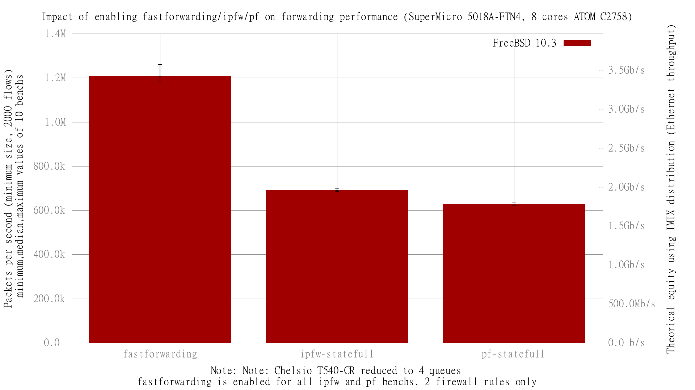

Impact of ipfw and pf on fastforwarding performance with queue number reduced to 4
  - SuperMicro SuperServer 5018A-FTN4 (8 cores Atom C2758 at 2.4GHz)
  - Quad port Chelsio 10-Gigabit T540-CR and OPT SFP (SFP-10G-LR)
  - FreeBSD 10.3
  - 2000 flows of smallest UDP packets
  - 2 static routes
  - ntxq10g and nrxq10g = 4
  - Traffic load at 14.88 Mpps

