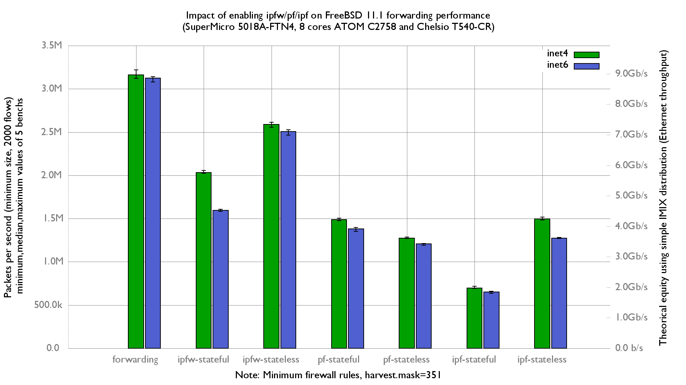

Impact of ipfw/pf/ipf on forwarding performance
  - SuperMicro SuperServer 5018A-FTN4 (8 cores Atom C2758 at 2.4GHz)
  - Quad port Chelsio 10-Gigabit T540-CR and OPT SFP (SFP-10G-LR)
  - FreeBSD 11.1
  - 2000 flows of smallest UDP packets
  - 2 static routes
  - Traffic load at 14.88 Mpps
  - harvest.mask=351

Flamegraph:
   - [forwarding inet4](bench.forwarding.inet4.1.pmc.svg)
   - [forwarding inet6](bench.forwarding.inet6.1.pmc.svg)
   - [ipf-stateful inet4](bench.ipf-stateful.inet4.1.pmc.svg)
   - [ipf-stateful inet6](bench.ipf-stateful.inet6.1.pmc.svg)
   - [ipf-state inet4](bench.ipf-stateless.inet4.1.pmc.svg)
   - [ipf-state inet6](bench.ipf-stateless.inet6.1.pmc.svg)
   - [ipfw-stateful inet4](bench.ipfw-stateful.inet4.1.pmc.svg)
   - [ipfw-stateful inet6](bench.ipfw-stateful.inet6.1.pmc.svg)
   - [ipfw-stateless inet4](bench.ipfw-stateless.inet4.1.pmc.svg)
   - [ipfw-stateless inet6](bench.ipfw-stateless.inet6.1.pmc.svg)
   - [pf-stateful inet4](bench.pf-stateful.inet4.1.pmc.svg)
   - [pf-stateful inet6](bench.pf-stateful.inet6.1.pmc.svg)
   - [pf-statefuless inet4](bench.pf-stateless.inet4.1.pmc.svg)
   - [pf-statefuless inet6](bench.pf-stateless.inet6.1.pmc.svg)

