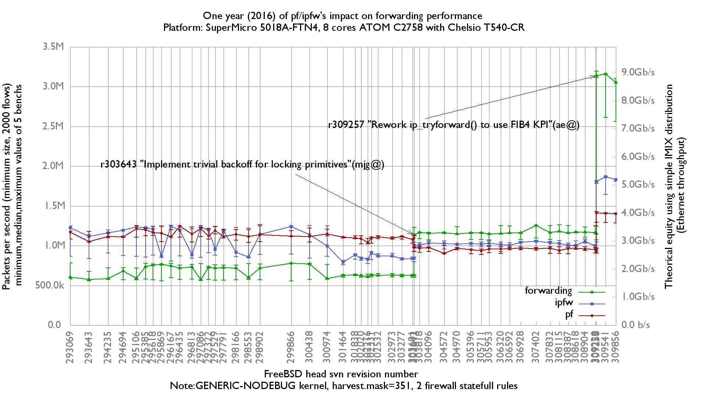

One year (2016) of ipfw/pf's impact on forwarding performance with Chelsio default queue number (=8)
  - SuperMicro SuperServer 5018A-FTN4 (8 cores Atom C2758 at 2.4GHz)
  - Quad port Chelsio 10-Gigabit T540-CR and OPT SFP (SFP-10G-LR)
  - 2000 flows of smallest UDP packets
  - 2 static routes
  - 2 statefull rules
  - Traffic load at 14.88 Mpps

