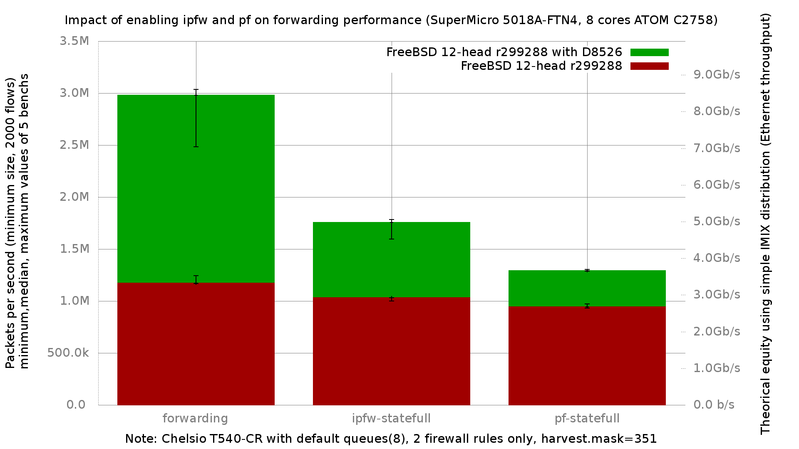

Impact of D8526 on ipfw, pf and forwarding performance with default queue number (=8)
  - SuperMicro SuperServer 5018A-FTN4 (8 cores Atom C2758 at 2.4GHz)
  - Quad port Chelsio 10-Gigabit T540-CR and OPT SFP (SFP-10G-LR)
  - FreeBSD 12-head r299288
  - 2000 flows of smallest UDP packets
  - 2 static routes
  - Traffic load at 14.88 Mpps
  - ntxq10g and nrxq10g = number of core (default) = 8
  - harvest.mask=351



ministat status with forwarding improvement:

```
x 299288.forwarding.pps
+ 299288D8526.forwarding.pps
+--------------------------------------------------------------------------+
| x                                                                  +     |
| x x                                              +                ++ +   |
||A_|                                                                      |
|                                                        |________A__M____||
+--------------------------------------------------------------------------+
    N           Min           Max        Median           Avg        Stddev
x   5       1166255       1245100       1171252     1185196.1     33660.491
+   5     2485464.5     3034491.5       2978710     2889226.6     227240.96
Difference at 95.0% confidence
        1.70403e+06 +/- 236905
        143.776% +/- 21.0225%
        (Student's t, pooled s = 162437)
```

ministat status with ipfw improvement:

```
x 299288.ipfw-statefull.pps
+ 299288D8526.ipfw-statefull.pps
+--------------------------------------------------------------------------+
|x  x                                                  +                   |
|x  x                                                  +              + ++ |
||_AM                                                                      |
|                                                       |________A____M___||
+--------------------------------------------------------------------------+
    N           Min           Max        Median           Avg        Stddev
x   5      999042.5       1032881       1030169     1018862.7      17394.21
+   5       1595048       1783825       1756750     1701717.2     97369.192
Difference at 95.0% confidence
        682854 +/- 102004
        67.0212% +/- 10.2849%
        (Student's t, pooled s = 69940.4)
```

ministat status with pf improvement:

```
x 299288.pf-statefull.pps
+ 299288D8526.pf-statefull.pps
+--------------------------------------------------------------------------+
|  x                                                                   +   |
|x x x  x                                                              ++++|
||_MA__|                                                                   |
|                                                                      |A_||
+--------------------------------------------------------------------------+
    N           Min           Max        Median           Avg        Stddev
x   5      933886.5      971239.5        944922        949856     14025.679
+   5     1287844.5     1302133.5       1292013       1293560     6241.8151
Difference at 95.0% confidence
        343704 +/- 15832
        36.1849% +/- 2.18173%
        (Student's t, pooled s = 10855.4)
```
