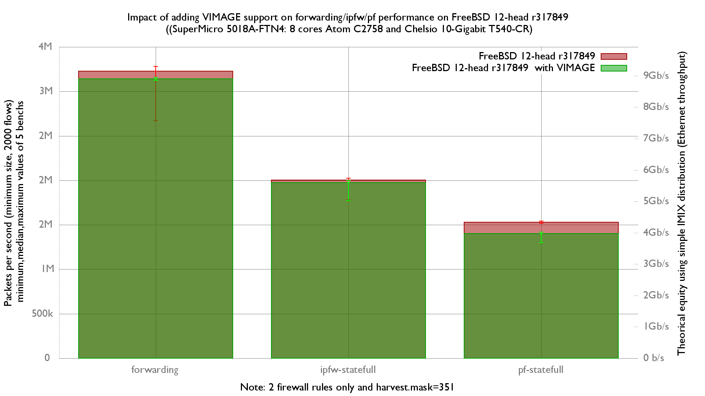

Impact of adding VIMAGE support on forwarding/ipfw/pf performance
  - SuperMicro SuperServer 5018A-FTN4 (8 cores Atom C2758 at 2.4GHz)
  - Quad port Chelsio 10-Gigabit T540-CR and OPT SFP (SFP-10G-LR)
  - FreeBSD 12-head r317849
  - 2000 flows of smallest UDP packets
  - 2 static routes
  - Traffic load at 14.88 Mpps




forwarding performance is not impacted:
```
x r317849 forwarding (packets-per-seconds)
+ r317849 with VIMAGE forwarding (packets-per-seconds)
+--------------------------------------------------------------------------+
|                                                   +                      |
|xx                                               + +++      x   x x       |
|    |_________________________________A_____________________M____________||
|                                                  |A|                     |
+--------------------------------------------------------------------------+
    N           Min           Max        Median           Avg        Stddev
x   5       2672370       3282914       3229279     3025957.4     320252.96
+   5       3125398       3158215       3142460       3143213     12156.575
No difference proven at 95.0% confidence
```

ipfw performance is not impacted:

```
x r317849 ipfw-statefull (packets-per-seconds)
+ r317849 with VIMAGE ipfw-statefull (packets-per-seconds)
+--------------------------------------------------------------------------+
|+  x                                              ++ *   +x  x x          |
|                      |_________________________A_________M______________||
|                   |______________________A________M______________|       |
+--------------------------------------------------------------------------+
    N           Min           Max        Median           Avg        Stddev
x   5       1782963     2022965.5       2002899     1960312.5     100300.61
+   5       1771830       1999262       1974279     1939427.4      94325.16
No difference proven at 95.0% confidence
```

But pf performance is decreased (-9.5%):

```
x r317849 pf-statefull (packets-per-seconds)
+ r317849 with VIMAGE.pf-statefull (packets-per-seconds)
+--------------------------------------------------------------------------+
|+                           +  + +  +                            x  x x  x|
|                                                                  |__AM_| |
|           |______________A____M________|                                 |
+--------------------------------------------------------------------------+
    N           Min           Max        Median           Avg        Stddev
x   5     1515930.5       1541172       1530878     1528673.3     9507.3018
+   5       1298631       1418767       1400996     1383531.8     48574.132
Difference at 95.0% confidence
        -145142 +/- 51043.8
        -9.49461% +/- 3.32793%
        (Student's t, pooled s = 34998.8)
```

flame graph:
   - [r317849 and forwarding](bench.317849.forwarding.svg)
   - [r317849 and ipfw-statefull](bench.317849.ipfw-statefull.svg)
   - [r317849 and pf-statefull](bench.317849.pf-statefull.svg)
   - [r317849 with VIMAGE and forwarding](bench.317849VIMAGE.forwarding.svg)
   - [r317849 with VIMAGE and ipfw-statefull](bench.317849VIMAGE.ipfw-statefull.svg)
   - [r317849 with VIMAGE and pf-statefull](bench.317849VIMAGE.pf-statefull.svg)

They were generated with this command:
```
stackcollapse-pmc.pl bench.312905.1.pmc.graph | flamegraph.pl > bench.312905.svg

```
