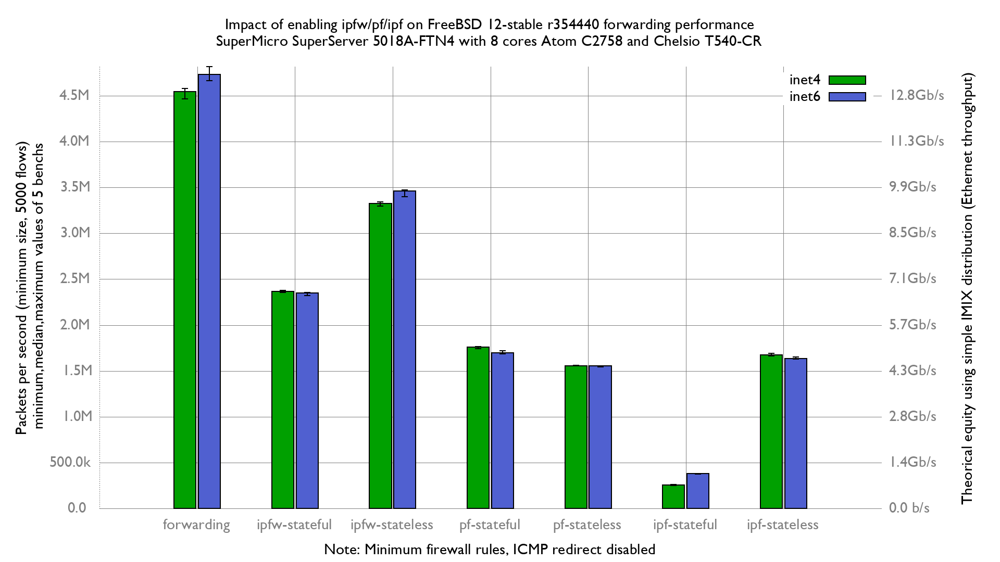

Impact of enabling firewalls on BSDRP 1.96 (FreeBSD 12-stable r354440) forwarding performance
  - SuperMicro SuperServer 5018A-FTN4 (8 cores Atom C2758 at 2.4GHz)
  - Quad port Chelsio 10-Gigabit T540-CR (10Giga DAC cable)
  - 5000 flows of smallest UDP packets
  - Minimum firewall rules
  - 2 static routes
  - Traffic load at 14.88 Mpps

