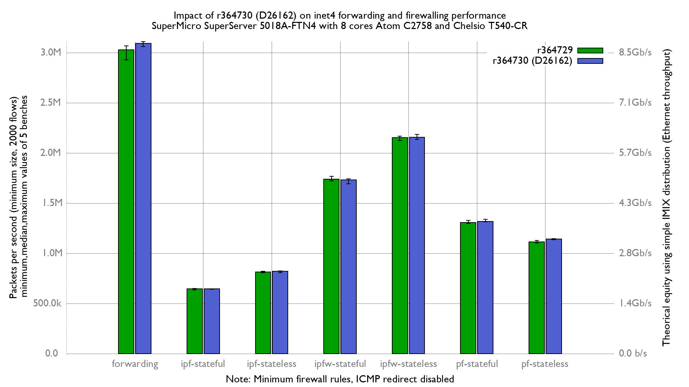
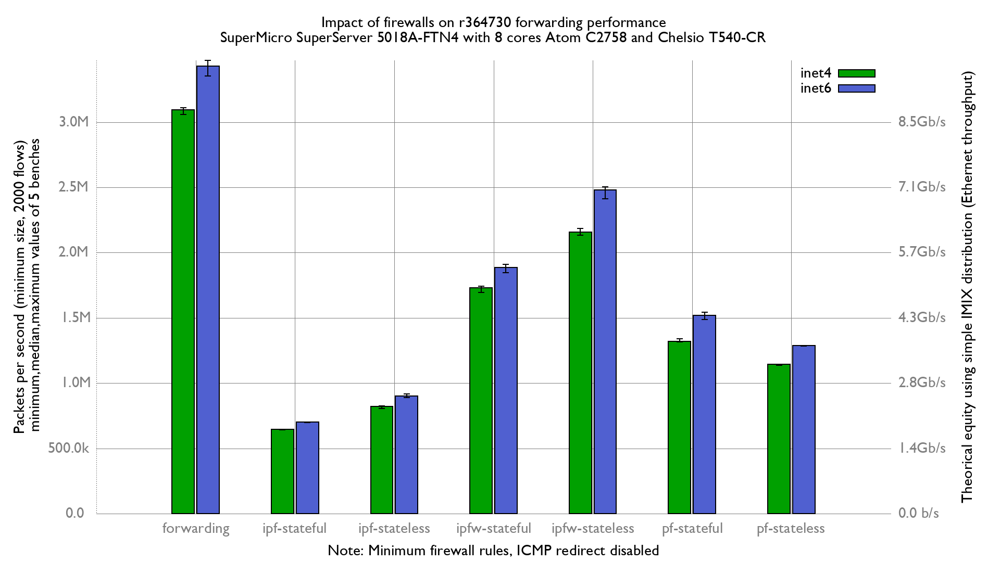

Impact of r364730 (D26162) on forwarding and firewalls:
  - SuperMicro SuperServer 5018A-FTN4 (8 cores Atom C2758 at 2.4GHz)
  - Quad port Chelsio 10-Gigabit T540-CR (10Giga DAC cable)
  - 5000 flows of smallest UDP packets
  - Minimum firewall rules
  - 2 static routes
  - Traffic load at 14.88 Mpps

Major improvement on inet4 forwarding (+2.3%), side effect because
rte size changed & rte's alignment :
```
x r364729: inet4 packets-per-second forwarded
+ r364730: inet4 packets-per-second forwarded
+--------------------------------------------------------------------------+
|x                                      xx        x   +  x        ++   +  +|
|               |_____________________A__M_________________|               |
|                                                          |______AM______||
+--------------------------------------------------------------------------+
    N           Min           Max        Median           Avg        Stddev
x   5       2927843       3066326       3028253     3019376.6     53783.396
+   5       3058976     3109196.5       3091841     3090243.7     19208.576
Difference at 95.0% confidence
        70867.1 +/- 58896.7
        2.34708% +/- 1.99128%
        (Student's t, pooled s = 40383.3)
```

Funny fact, inet6 forwarding is 10% faster than inet4:
```
x r364730: inet4 paquets-per-second forwarded
+ r364730: inet6 paquets-per-second forwarded
+--------------------------------------------------------------------------+
|                                                                 +        |
|x    xx xx                                          +            ++      +|
|  |___A__|                                                                |
|                                                         |______AM______| |
+--------------------------------------------------------------------------+
    N           Min           Max        Median           Avg        Stddev
x   5       3058976     3109196.5       3091841     3090243.7     19208.576
+   5       3354086     3472440.5       3426722     3422020.9     42700.448
Difference at 95.0% confidence
	331777 +/- 48286.3
	10.7363% +/- 1.59201%
	(Student's t, pooled s = 33108.1)
```




