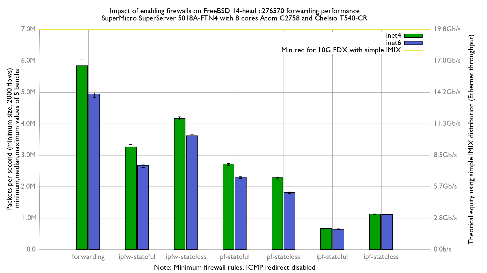

# Impact of enabling firewalls on BSDRP 1.991 (FreeBSD 14 c276570) forwarding performance
lab:
  - SuperMicro SuperServer 5018A-FTN4 (8 cores Atom C2758 at 2.4GHz)
  - Quad port Chelsio 10-Gigabit T540-CR (10Giga DAC cable)
  - FreeBSD 14-head c276570
  - 2 static routes
  - harvest.mask=351
  - ICMP redirect disabled
  - 2000 UDP flows
  - Traffic load at 14.88 Mpps

# Results

## Graph

## flamegraph

### inet

  - [forwarding: inet](bench.forwarding.inet4.svg)
  - [ipfw-stateless: inet](bench.ipfw-stateless.inet4.svg)
  - [ipfw-stateful: inet](bench.ipfw-stateful.inet4.svg)
  - [pf-stateless: inet](bench.pf-stateful.inet4.svg)
  - [pf-stateful: inet](bench.pf-stateless.inet4.svg)
  - [ipf-stateless: inet](bench.ipf-stateless.inet4.svg)
  - [ipf-stateful: inet](bench.ipf-stateful.inet4.svg)

## inet6

  - [forwarding: inet6](bench.forwarding.inet6.svg)
  - [ipfw-stateless: inet6](bench.ipfw-stateless.inet6.svg)
  - [ipfw-stateful: inet6](bench.ipfw-stateful.inet6.svg)
  - [pf-stateless: inet6](bench.pf-stateless.inet6.svg)
  - [pf-stateful: inet6](bench.pf-stateful.inet6.svg)
  - [ipf-stateless: inet6](bench.ipf-stateful.inet6.svg)
  - [ipf-stateful: inet6](bench.ipf-stateless.inet6.svg)
