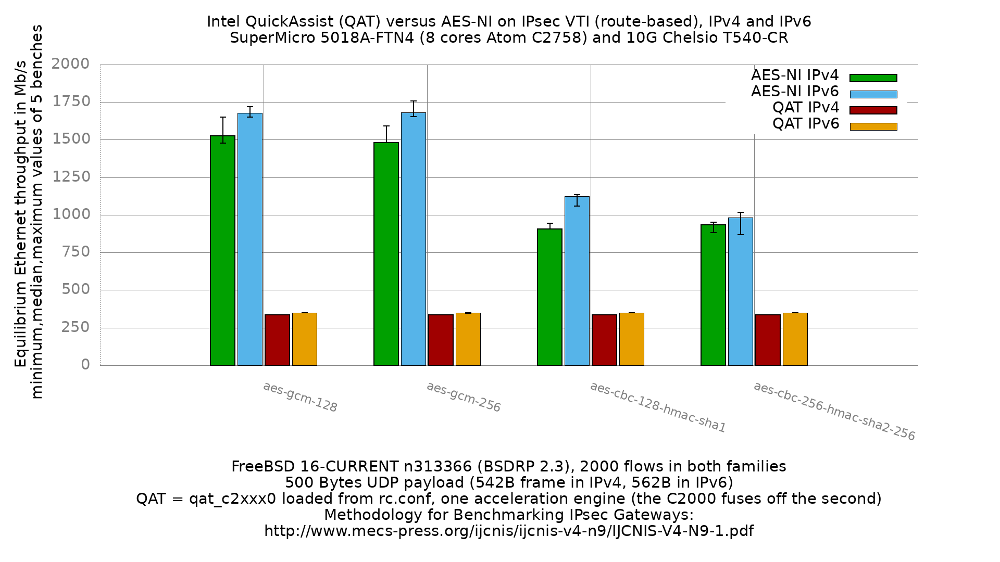

Intel QuickAssist (QAT) versus AES-NI on IPsec VTI (IPv4 and IPv6)
  - SuperMicro SuperServer 5018A-FTN4 (8 cores Atom C2758 at 2.4GHz), DUT = sm1
  - Quad port Chelsio 10-Gigabit T540-CR
  - FreeBSD 16-CURRENT n313366 (BSDRP 2.3)
  - QAT arm: `qat_c2xxx0: <Intel C2000 QuickAssist PF>` at `pci0:0:11:0`,
    loaded from `rc.conf` with `kld_list="qat_c2xxxfw qat_c2xxx"`
  - AES-NI arm: same configuration with no `kld_list`, so the device stays
    `none0` and `aesni0` serves every session
  - `kern.crypto.allow_soft=0` in both arms, so there is no softcrypto fallback
  - **VTI (route-based)**: `if_ipsec(4)`, reqid 100 on the DUT, 200 on the peer
  - 2000 flows of clear UDP packets, IPv4 and IPv6
  - 500Bytes UDP load => 542B Ethernet frame in IPv4, 562B in IPv6



**Enabling QAT on this platform costs between 63% and 79% of the throughput,
depending on the cypher it replaces.** It is not an accelerator here: it is
slower than the AES-NI path it displaces, for every cypher tested and in both
address families. The loss is largest against the cyphers AES-NI handles best
(78% for aes-gcm-128 in IPv4, 79% in IPv6) and smallest against the slowest
one (63% for aes-cbc-128-hmac-sha1 in IPv4), simply because QAT delivers the
same number either way.

```
                               IPv4                      IPv6
cypher                      AES-NI   QAT  ratio     AES-NI   QAT  ratio
aes-gcm-128                   1526   334   0.22       1678   348   0.21
aes-gcm-256                   1482   334   0.23       1682   348   0.21
aes-cbc-128-hmac-sha1          908   334   0.37       1126   348   0.31
aes-cbc-256-hmac-sha2-256      934   334   0.36        982   348   0.35
```

Values are Mb/s, median of 5 benches. The AES-NI columns are the two arms of
[`../fbsd16-n313366.BSDRP.2.3/`](../fbsd16-n313366.BSDRP.2.3/README.md),
measured at the same 2000 flows with the same frame sizes.

There is no `null` set in this bench: with no cypher there is nothing for a
crypto accelerator to do, so the comparison would be meaningless.

## The same packet rate in both families

IPv6 reads 4% higher than IPv4 in Mb/s, but that is the frame size, not extra
work done. Converting to packets tells the real story:

```
family   frame   QAT Mb/s   packet rate
IPv4      542B        334      77.0 kpps
IPv6      562B        348      77.4 kpps
```

Half a percent apart. The DUT pushes **the same number of packets per second
regardless of address family**, and the Mb/s difference is only the 20 extra
bytes of IPv6 header riding along with each one. (The same holds if the
20 bytes of preamble and inter-frame gap are counted: 74.3 against 74.7 kpps.)

That is what a per-request limit looks like. The QAT ring is dispatched once
per packet, so its capacity is counted in requests, and the size or address
family of the packet each request carries does not change how many fit.

**This erases the IPv6 finding from the AES-NI set.** There, IPv6 was the
*faster* family with crypto (1678 against 1526 for aes-gcm-128) because the
forwarding path saturated at about 1670 Mb/s and bound before the cypher did.
Under QAT the accelerator binds first at roughly 77 kpps, which is far below
both the cypher limit and that forwarding-path limit, so neither is ever
reached and the difference between the families disappears.

## Every cypher lands on the same number

The QAT columns above are not a rounding artifact. Every cypher measured the
same value on every iteration, across separate boots:

```
                               IPv4                      IPv6
cypher                      iterations  max      iterations       max
aes-gcm-128                 334 x5      519-521  348 x5           507-510
aes-gcm-256                 334 x5      520      348 x4, 347 x1   507-509
aes-cbc-128-hmac-sha1       334 x5      520-522  348 x5           506-507
aes-cbc-256-hmac-sha2-256   334 x5      520-521  348 x5           506
```

Zero spread is itself the finding. On AES-NI these cyphers differ by 1.7x in
IPv4 (908 to 1526) and 1.7x in IPv6 (982 to 1682), and IPv4 aes-gcm spreads
1476 to 1650 between iterations. Once QAT is enabled the cypher stops
mattering: AES-GCM and AES-CBC+HMAC, different algorithm classes with
different work per packet, become indistinguishable, and so do the two
address families once converted to packets.

The single 347 in IPv6 aes-gcm-256 is the only non-zero spread anywhere in
this campaign: one iteration, 1 Mb/s, against a 348 in the other four. That is
rounding at the search's tolerance floor, not a second mode.

That is what a queue limit looks like rather than a compute limit. The DUT is
not spending its time in the cypher, so making the cypher cheaper or more
expensive changes nothing.

## The counters name the bottleneck

`AFTER_CMD` captured `kern.crypto.stats` and the QAT statistics on every
iteration. Field 2 of `kern.crypto.stats` is the dispatch-failure count, and
it matches `dev.qat_c2xxx.0.stats.ring_full` exactly, on all forty QAT
iterations in both families:

```
arm              total ops   dispatch failures   ring_full   share
QAT   IPv4        23849051             4693782     4693782   19.7%
QAT   IPv6        23307219             4546585     4546585   19.5%
AES-NI IPv4       75899349                   0           -    0.0%
```

Each row is one representative iteration; the failure share is stable across
all forty, spanning 19.3% to 19.6% in IPv6 (4503479 to 4569095 failures).

About one request in five finds the QAT ring full and cannot be queued, and
that share is the same in both families, as a per-request limit predicts. The
AES-NI control, measured in the same session on the same DUT, dispatched 3.2x
more operations with zero failures.

The hardware reason is in dmesg on every boot:

```
qat_c2xxx0: <Intel C2000 QuickAssist PF> mem 0xdd980000-0xdd99ffff,0xdda10000-0xdda13fff at device 11.0 on pci0
qat_c2xxx0: disabling second AE
```

Only one of the two acceleration engines comes up. A single AE, fed by eight
Atom cores, saturates well below what AES-NI sustains on those same cores.

The total-ops figures are close between families but should not be read as
evidence that the two carried equal work: the offer schedule is deterministic,
so a similar number of packets is sent either way. The dispatch-failure
*share* is the comparable quantity.

## Reading the offer walk

The search descends from its first offer in every iteration, in both
families, which is the signature of a ceiling being hit immediately rather
than a knee being found:

```
IPv4                                    IPv6
  Offering load     = 1000 Mb/s           Offering load     = 1000 Mb/s
  Measured rate     =  519 Mb/s           Measured rate     =  507 Mb/s
  Offering load     =  500 Mb/s           Offering load     =  500 Mb/s
  Measured rate     =  342 Mb/s           Measured rate     =  350 Mb/s
  Offering load     =  250 Mb/s           Offering load     =  250 Mb/s
  Measured rate     =  250 Mb/s           Measured rate     =  249 Mb/s
```

At 250 Mb/s the DUT forwards everything offered. Above that it delivers about
520 in IPv4 and 507 in IPv6 regardless of how much more is offered, and the
equilibrium settles at 334 and 348 respectively.

The gap between that peak and the equilibrium is the ring overflowing under
sustained load: short bursts clear, sustained offers do not.

Unlike the equilibrium, the peak does *not* convert to the same packet rate in
both families: 520 Mb/s at 542B is 119.9 kpps, 507 Mb/s at 562B is 112.8 kpps,
6% apart. The peak is a single transient sample taken before the ring fills,
so it is a much noisier quantity than the sustained equilibrium and not worth
reading closely.

## Why the module is loaded from rc.conf and not the loader

`qat_c2xxx_load="YES"` in `loader.conf` panics this hardware. The driver
attaches during early PCI enumeration and sleeps before the timer subsystem
exists:

```
qat_c2xxx0: <Intel C2000 QuickAssist PF> ... at device 11.0 on pci0
qat_c2xxx0: disabling second AE
panic: timed sleep before timers are working
  sleepq_set_timeout_sbt <- _sleep <- qat_adm_ring_send_init_msg
  <- qat_adm_ring_send_init <- qat_start <- qat_attach
  <- device_attach <- pci_attach <- acpi_pci_attach
```

That is a panic-reboot loop needing console intervention. Loading from
`rc.conf` via `kld_list` runs the same attach path after rc(8) starts, when
timers work, and it succeeds. Note this contradicts `qat_c2xxx(4)`, which
documents the `loader.conf` method.

Two further notes for anyone reproducing this:

  - The firmware module must be resident before the PF driver attaches, so the
    order in `kld_list` is `qat_c2xxxfw qat_c2xxx`.
  - `qat_c2xxxfw.ko` cannot be unloaded once loaded (`kldunload: can't unload
    file: Device busy`) even after the PF driver is detached. Only a reboot
    clears it. Every iteration here starts from a fresh boot, so this does not
    affect the measurements, but it does mean an A/B cannot be done by loading
    and unloading within one boot.

## What this does not say

This is one QAT generation on one chip. The C2000 QAT is an early,
single-AE-after-fusing part, and the result here should not be read as a
statement about QAT on later hardware (C3xxx, C62x, 4xxx), where the
engine count and ring capacity differ.

It also does not test QAT's asymmetric (public-key) path, which is where a
crypto accelerator usually earns its place. IKE negotiation is not measured by
this bench: the SAs are static, so every packet exercises only the symmetric
path.

## Verifying an arm really used the backend it claims

A QAT run that silently fell back to AES-NI would look like a good result
rather than an error, so each iteration records its own provenance.
`BEFORE_CMD` captures `/var/run/crypto-state.txt`, written by `rc.local`:

```
--- crypto drivers registered:
dev.qat_c2xxx.0.%driver: qat_c2xxx
dev.aesni.0.%driver: aesni
dev.cryptosoft.0.%driver: cryptosoft
--- qat device claimed:
qat_c2xxx0@pci0:0:11:0: class=0x0b4000 ... device=0x1f18
```

Note `aesni0` is still registered in the QAT arm: both drivers are present and
QAT wins the sessions. The decisive check is the post-run counter, since
driver registration alone would not prove which one carried the traffic. A
zero `ring_full` with a zero dispatch-failure count would mean the sessions
went to AES-NI and the number is not a QAT measurement.

## Raw data

`RAW/` holds the per-iteration pkt-gen sender dumps plus the `.before` and
`.after` captures carrying the crypto counters quoted above, for both
families. IPv4 files are named `bench.<cypher>.<n>.*` under `RAW/inet4/` and
IPv6 under `RAW/inet6/`.

The data files follow the same split: `inet4.qat.data` / `inet6.qat.data` hold
the QAT medians, `inet4.aesni.data` / `inet6.aesni.data` the AES-NI baselines
copied from the sibling 2kflows set.

Configuration sets are in `../../configs.qat/`, which holds only the `dut/`
halves: the two arms share the `refendpoint/` halves in `../../configs/`
unchanged, since the peer configuration does not differ between them.

Note the harness reboots the reference endpoint only for a configuration set
that contains both a `dut/` and a `refendpoint/` directory. To keep the peer
untouched across the sweep, each set was copied to a temporary tree with the
`dut/` level stripped, and that flattened copy was passed to `-c`.
