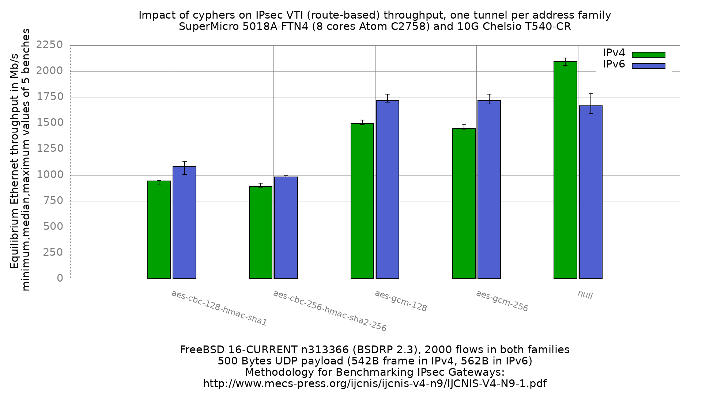

Impact of cyphers on IPsec VTI (route-based) performance, one tunnel per address family
  - SuperMicro SuperServer 5018A-FTN4 (8 cores Atom C2758 at 2.4GHz), DUT = sm1
  - Quad port Chelsio 10-Gigabit T540-CR
  - FreeBSD 16-CURRENT n313366 (BSDRP 2.3)
  - AES-NI in the kernel (`dev.aesni.0` plus `dev.cryptosoft.0`, no QAT device
    claimed in any of the 50 `.before` captures)
  - **VTI (route-based)**: two `if_ipsec(4)` interfaces, one per outer address
    family. `ipsec0` has an IPv4 outer endpoint pair (reqid 100 on the DUT, 200
    on the peer); `ipsec1` has an IPv6 outer pair (reqid 101 / 201). SAs bound
    with `-u`, no SPD entry.
  - 2000 flows of clear UDP packets in **both** families
  - LRO disabled on both DUT interfaces
  - 500Bytes UDP load => 542B Ethernet frame in IPv4, 562B in IPv6

This is the first VTI set in this repository that measures IPsec over an IPv6
tunnel. Every previous one tunnelled both address families over a single IPv4
ESP tunnel, because `if_ipsec(4)` carries exactly one outer endpoint pair per
interface and `ifconfig_ipsecN_ipv6` sets an *inner* address, not a second
outer. The predecessor set
[`fbsd16-n313366.BSDRP.2.3`](../fbsd16-n313366.BSDRP.2.3/README.md) carries the
correction notice; its IPv4 column stands, its IPv6 column was withdrawn.



```
cypher                      IPv4   IPv6
null                        2093   1666
aes-gcm-128                 1496   1716
aes-gcm-256                 1450   1717
aes-cbc-128-hmac-sha1        943   1082
aes-cbc-256-hmac-sha2-256    890    982
```

Values are Mb/s, median of 5 benches. Both arms were run in one sitting on the
same day, on the same DUT boot sequence, with the same generator binary and the
same flow count.

## The tunnel separation is verified, not assumed

Each iteration records `netstat -I ipsec0 -b` and `netstat -I ipsec1 -b` after
the traffic. In all 50 iterations the tunnel whose outer family matches the
bench carried the load and the other sat at 9 packets of neighbour-discovery
noise. IPv4 `null` iteration 1:

```
ipsec0  1400 <Link#9>   ...  108749889 pkts    (IPv4 outer, carried the bench)
ipsec1  1400 <Link#10>  ...          9 pkts    (IPv6 outer, idle)
```

IPv6 `null` iteration 1, the exact mirror:

```
ipsec0  1400 <Link#9>   ...          9 pkts    (IPv4 outer, idle)
ipsec1  1400 <Link#10>  ...   75266766 pkts    (IPv6 outer, carried the bench)
```

## IPv6 moves more packets per second than IPv4 whenever crypto is on

Converting to packet rate, using the 542B IPv4 and 562B IPv6 frame sizes:

```
cypher                     v4 kpps   v6 kpps   v6/v4
null                         482.7     370.5    0.76
aes-gcm-128                  345.0     381.6    1.10
aes-gcm-256                  334.4     381.8    1.14
aes-cbc-128-hmac-sha1        217.4     240.6    1.10
aes-cbc-256-hmac-sha2-256    205.2     218.4    1.06
```

`null` behaves as physics requires: the IPv6 frame is 20B larger, so at a given
packet rate it costs more bytes, and the ratio sits below 1. Every cypher
inverts it. IPv6 forwards 6 to 14% *more* packets per second than IPv4 while
each of those packets is larger.

**A fixed per-packet IPv6 overhead cannot produce this.** Such an overhead
would push the ratio towards 1.0 from below as crypto came to dominate the
cost, and could never cross it.

This measurement was made specifically to test whether the one-IPv4-tunnel
defect explained the same anomaly seen in the predecessor set. **It does not.**
The anomaly survives a correctly-tunnelled IPv6 measurement, at matched flow
counts, in a single session. The cause is open.

What is now ruled out:
  - the tunnel-family defect (this set has a real IPv6 tunnel, verified above)
  - flow-count mismatch (2000 flows in both arms)
  - session or boot drift (both arms same sitting)
  - generator version (same binary, unmodified, for both arms)

## Per-iteration values

IPv4:

```
cypher                      1     2     3     4     5    median
null                     2127  2059  2058  2093  2114    2093
aes-gcm-128              1531  1485  1496  1491  1522    1496
aes-gcm-256              1442  1483  1450  1441  1452    1450
aes-cbc-128-hmac-sha1     920   950   946   943   902     943
aes-cbc-256-hmac-sha2-256 888   896   890   884   920     890
```

IPv6:

```
cypher                      1     2     3     4     5    median
null                     1656  1780  1593  1781  1666    1666
aes-gcm-128              1704  1717  1701  1779  1716    1716
aes-gcm-256              1689  1684  1717  1717  1780    1717
aes-cbc-128-hmac-sha1    1046  1108  1131  1082  1006    1082
aes-cbc-256-hmac-sha2-256 982   993   982   982   982     982
```

## Frame loss, and which iterations are affected

`BEFORE_CMD` and `AFTER_CMD` capture `dev.cxl.1.stats.rx_frames` and
`dev.cxl.0.stats.tx_frames`, so the frames the DUT received but never forwarded
are countable per iteration.

Every IPv4 iteration forwarded everything it received, with one exception:
**aes-cbc-256 iteration 4 dropped 2995990 of 40537236 frames (7.4%)**. Its
first probe returned 543 Mb/s where the other iterations returned 816 to 929,
so it collapsed harder than usual on the initial overload probe and shed frames
there. `kern.crypto.stats` field 2 is 0, so this was not a crypto dispatch
failure. The iteration is retained: its converged value (884) sits inside the
884-920 cluster of the other four, because the loss happened during the early
overload probe and not at convergence.

The IPv6 AES-CBC arms lose frames on **every** iteration: 6.7 to 7.9% for
aes-cbc-128, 1.2 to 12.2% for aes-cbc-256. This is a property of where
`equilibrium`'s offer ladder falls relative to capacity, not of the DUT.
aes-cbc-128 iteration 3 illustrates it:

```
  - Offering load = 1000 Mb/s    - Measured forwarding rate = 999 Mb/s
  - Offering load = 1500 Mb/s    - Measured forwarding rate = 1083 Mb/s
  - Offering load = 1250 Mb/s    - Measured forwarding rate = 1113 Mb/s
  - Offering load = 1125 Mb/s    - Measured forwarding rate = 1125 Mb/s
  - Offering load = 1187 Mb/s    - Measured forwarding rate = 1131 Mb/s
  - Offering load = 1156 Mb/s    - Measured forwarding rate = 1124 Mb/s
  - Offering load = 1141 Mb/s    - Measured forwarding rate = 1131 Mb/s
```

Capacity is near 1125 and four of the seven probes were offered above it. Each
overshoot sheds frames. The IPv4 arm of the same cypher converges from below
and so never overloads, which is why its loss is zero. The reported values are
taken at offers the DUT absorbed, so they are not inflated by the loss; the
counter deltas are the sum over the whole run including the deliberate
overshoots.

One IPv6 aes-cbc-256 iteration is a different case. **Iteration 2 dropped
12.2% (6489053 of 53293926 frames)** and is the only iteration of that cypher
reporting above 982 (993, with a maximum-seen of 1013). It was saturated and
losing while reporting a high number. Do not cite its 1013; the median of 982
is unaffected because the other four iterations all converged there.

## Reading this set against the others

  - The predecessor set's IPv4 column is comparable to this one's. Both ran
    2000 flows over a real IPv4 tunnel. `null` moved 2036 to 2093 and
    aes-cbc-128 908 to 943, both about 3%.
  - The predecessor's IPv6 column is **not** comparable to this one's: it was
    an IPv4 tunnel.
  - aes-gcm medians must not be differenced against other result sets. That
    cypher's knee sits between two rungs of the offer ladder, so its median
    reports which side of a rung the majority of probes fell on. See the
    predecessor README.
  - With QAT enabled the accelerator binds far below AES-NI and both families
    collapse to roughly the same packet rate, so none of the ratios here apply
    to a QAT configuration. See
    [`fbsd16-n313366.BSDRP.2.3.qat`](../fbsd16-n313366.BSDRP.2.3.qat/README.md).

## How it was run

  - config sets: [`../../configs/`](../../configs/) (one directory per cypher).
    Each ships `dut/` only. `bench-lab.sh` uploads a `refendpoint/` only when a
    set contains both, and it reboots the peer between sets; the peer here is
    bigone, the lab's own workstation, which is not nanobsd and must not be
    rebooted ten times. `refendpoint/etc/rc.conf` is therefore the versioned
    record of what bigone must have, applied by hand, and its
    `refendpoint/etc/ipsec.conf` is loaded per cypher with `setkey -F` then
    `setkey -f`. Skipping that flush leaves stale peer SAs that kill the bench
    at the first offer while both ends still report the interface UP.
  - lab config:
    [`../../../bench-lab-3nodes.equilibrium.vlan.config`](../../../bench-lab-3nodes.equilibrium.vlan.config).
    The three nodes are not directly cabled: they meet on switch10g, which
    segregates them into three VLANs, one per hop, so each interface carries
    one direction only.
  - generator: `equilibrium -4` / `-6`, `-l 2000`, 2000 flows in both families.
    `-l` is the link rate the search seeds from; it sets the offer ladder, so
    it must not change mid-sweep or the sets stop being comparable.

## Files

  - `gnuplot.data`, `gnuplot.data.max` — both families, median and
    maximum-seen aggregations
  - `inet4.data`, `inet6.data` (plus `.max`) — per-family, fed to the histogram
  - `RAW/` — 160 files: per-iteration `.sender` dumps and the `.before` /
    `.after` DUT captures that carry the SA state, per-interface tunnel
    counters and NIC frame counters
