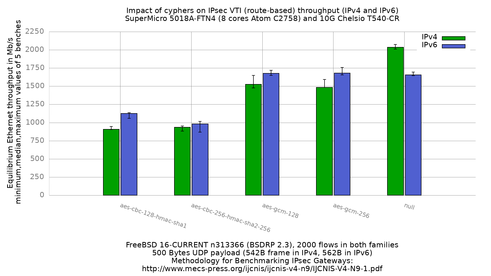

Impact of cyphers on IPsec VTI (route-based) performance
  - SuperMicro SuperServer 5018A-FTN4 (8 cores Atom C2758 at 2.4GHz), DUT = sm1
  - Quad port Chelsio 10-Gigabit T540-CR
  - FreeBSD 16-CURRENT n313366 (BSDRP 2.3)
  - AES-NI in the kernel (`aesni0: <AES-CBC,AES-CCM,AES-GCM,AES-ICM,AES-XTS>`),
    `kern.crypto.allow_soft=0`
  - **VTI (route-based)**: `if_ipsec(4)` interface, reqid 100 on the DUT and
    200 on the peer, SAs bound to it with `-u`, no SPD entry
  - **The ESP tunnel is IPv4 in both arms.** See the correction below: the
    column labelled IPv6 carries IPv6 *inner* packets through that same IPv4
    tunnel, so it is not an IPv6 IPsec measurement.
  - 2000 flows of clear UDP packets
  - LRO disabled on both DUT interfaces
  - 500Bytes UDP load => 542B Ethernet frame in IPv4, 562B in IPv6

> **Correction (2026-09-29).** This set was published with a cross-family
> comparison that its own raw data does not support. Both arms encapsulated
> into a single IPv4 ESP tunnel; the IPv6 SAs were installed but never
> matched a packet. The sections that drew IPv6 conclusions are struck
> through below and replaced with what the data actually shows. The IPv4
> column is unaffected and stands as measured.
>
> **Replaced (2026-09-30) by
> [`fbsd16-n313366.BSDRP.2.3.vti-dualtunnel`](../fbsd16-n313366.BSDRP.2.3.vti-dualtunnel/README.md)**,
> which runs two `if_ipsec(4)` interfaces so each address family gets its own
> outer endpoint pair, and re-measures both arms in one sitting. Use that set
> for any IPv6 figure and for any cross-family comparison. Note its finding:
> the IPv6-faster-per-packet anomaly **survives** the fix, so the single-tunnel
> defect was never its explanation.



```
                             IPv4   "IPv6"
cypher                     tunnel   inner-only
null                         2036   1655
aes-gcm-128                  1526   1678
aes-gcm-256                  1482   1682
aes-cbc-128-hmac-sha1         908   1126
aes-cbc-256-hmac-sha2-256     934    982
```

Values are Mb/s, median of 5 benches. **The second column is not IPv6 IPsec.**
Both columns ran the same IPv4 ESP tunnel; the second differs only in that the
packets *inside* the tunnel were IPv6. Read it as "IPv6 payload over an IPv4
tunnel", and do not compare it against an IPv6 IPsec figure from elsewhere.

## Why this set exists

It replaces an earlier set that was withdrawn as a cross-family comparison:
its IPv4 arm generated ~4970 flows against the IPv6 arm's 2000, so no
IPv4-to-IPv6 ratio in it was flow-matched. Here both arms run 2000 flows.
That set's own withdrawal note is kept as [`WITHDRAWN-5kflows-v4.md`](WITHDRAWN-5kflows-v4.md);
its measurements are superseded by the ones here and were not retained.

**Matching the flow counts did not rescue the cross-family comparison.** The
ratios in this set are unusable for a different and larger reason, found on
2026-09-29 and documented below: both arms ran an IPv4 tunnel. The withdrawn
set shares that defect, so neither set has ever measured IPv6 IPsec. What this
set does deliver is a sound IPv4 result at a known flow count.

**The flow count turned out not to matter on this DUT.** Re-measuring IPv4 at
2000 flows instead of ~4970 moved the unimodal cyphers by about 1%:

```
cypher                     5k flows   2k flows   delta
null                           2062       2036   -1.3%
aes-cbc-128-hmac-sha1           920        908   -1.3%
```

So the withdrawn set's per-family IPv4 figures were not wrong, and the defect
was confined to the ratios. The IPv6 arm is unchanged between the two sets (it
already ran 2000 flows) and measures the same: null 1661 then 1655, cbc-128
1119 then 1126.

## Withdrawn: the cross-family comparison

This section previously reported that IPv6 was *faster per packet* than IPv4
once crypto was enabled, called it unexplained, and noted that hwpmc showed no
shift in where cycles went. **The finding was an artifact of the lab
configuration and is withdrawn.**

`if_ipsec(4)` carries **one outer tunnel endpoint pair per interface**. Both
the DUT and the peer built a single `ipsec0` with an IPv4 outer:

```
cloned_interfaces="ipsec0"
create_args_ipsec0="reqid 100"
ifconfig_ipsec0="inet 198.18.2.4/24 198.18.2.2 tunnel 198.18.1.4 198.18.1.2"
ifconfig_ipsec0_ipv6="inet6 2001:2:0:2::4 prefixlen 64"
```

The `tunnel` keyword names an IPv4 pair. `ifconfig_ipsec0_ipv6` adds an
*inner* address for the payload, not a second outer, which is what made the
configuration look dual-stack. It is not: every packet of both arms was
encapsulated into the IPv4 SA at reqid 100.

The `.after` captures prove it on all 25 iterations of the IPv6 arm. One
representative iteration:

```
198.18.1.4 198.18.1.2      spi=4097  allocated: 52360927  current: 32254326904(bytes)
2001:2:0:1::4 2001:2:0:1::2 spi=4103  allocated: 0         current: 0(bytes)
```

The two IPv6 SAs were installed by `setkey` and matched nothing. Confirmed
live on the peer, which reports `tunnel inet 198.18.1.2 --> 198.18.1.4` and
zero allocations on both of its IPv6 SAs.

The generator was correct: it ran `equilibrium -6`, so the *inner* packets
really were IPv6. Only the tunnel was not.

**So the two arms share an identical tunnel, ESP path, SA lookup and outer
header, and differ only in the inner packet.** That removes the puzzle:

```
cypher                      v4 kpps  v6 kpps  v6/v4
null                          469.6    368.1   0.78
aes-gcm-128                   351.9    373.2   1.06
aes-gcm-256                   341.8    374.1   1.09
aes-cbc-128-hmac-sha1         209.4    250.4   1.20
aes-cbc-256-hmac-sha2-256     215.4    218.4   1.01
```

  - **null, 0.78**: no crypto, so per-packet cost is dominated by inner
    forwarding, where IPv6 is genuinely more expensive. IPv6 loses, as
    expected.
  - **the crypto rows, 1.01 to 1.20**: ESP cost scales with payload bytes.
    The IPv6 inner packet is 20B larger, so at equal Mb/s it carries fewer
    packets and the fixed per-packet tunnel cost amortises over more bytes.
    Fewer, larger packets through the same tunnel is cheaper per packet.

A fixed per-packet IPv6 overhead could not cross 1.0, which is why the
original framing looked paradoxical. There was no IPv6 tunnel overhead to
pay, because there was no IPv6 tunnel.

The hwpmc callgraphs in `PMC/` matched to under half a point because they
profile the **null** cypher, where the two arms genuinely do near-identical
work. The crossover only appears with crypto, and that arm was never profiled.

The same defect is present in the sibling QAT set.

The [APU2 VTI set](../../../../../AMD_GX-412TC_4Cores/Intel_i210AT/ipsec/results/fbsd16-n313366.BSDRP.2.3/README.md)
tunnels each family over its own address family and measures IPv6 at a v6/v4
packet-rate ratio of 0.91 to 0.97, i.e. slower than IPv4 on every cypher. That
is the **opposite** sign to this machine's dual-tunnel set, which has IPv6
forwarding 6 to 14% *more* packets per second than IPv4 whenever crypto is on.
The two platforms disagree and the APU2 numbers do not explain the Atom result.

## Withdrawn: "in IPv6 the forwarding path is the limit"

This section previously read null 1655, aes-gcm-128 1678 and aes-gcm-256 1682
as three very different cyphers landing within 27 Mb/s, and concluded that an
IPv6 forwarding path saturating near 1670 Mb/s bound before the cypher did.

**There is no IPv6 forwarding-path ceiling in this data**, because the tunnel
was IPv4. The clustering is real and still needs an explanation, but it is a
property of IPv6-inner-over-IPv4-tunnel on this DUT, not of IPv6 forwarding,
and this set cannot separate the two. The claim is withdrawn rather than
reinterpreted.

What survives unchanged: AES-CBC sits well below that cluster (1126 and 982)
and orders correctly by cost, so whatever binds at ~1670 is not a ceiling
that hides all cypher differences.

## The reported equilibrium understates the weak cyphers

equilibrium reports whatever its *last* probe measured once the step falls
below tolerance. There is no confirmation pass. When a probe near the knee
dips, that dip becomes the answer even though the search already sustained a
higher rate. The `maximum value seen` field, aggregated here into
`gnuplot.data.max`, does not have that failure mode.

For the AES-CBC cyphers the difference is large and the max series is
dramatically more repeatable:

```
                              reported (median/min/max)   max seen (median/min/max)
inet6.aes-cbc-256-hmac-sha2-256    982 /  869 / 1017        1049 / 1048 / 1050
inet4.aes-cbc-256-hmac-sha2-256    934 /  884 /  952         958 /  940 /  999
inet6.aes-cbc-128-hmac-sha1       1126 / 1058 / 1136        1158 / 1136 / 1176
```

Five IPv6 aes-cbc-256 runs peaked at 1048, 1049, 1049, 1050 and 1048 Mb/s: a
3 Mb/s spread. Their reported equilibria spread 148 Mb/s. The DUT did the same
work every time and the search stopped in a different place.

**So for the AES-CBC cyphers, read `gnuplot.data.max`.** For AES-GCM do not:
its max series is contaminated the other way. `inet4.aes-gcm-128` shows a
1999 Mb/s maximum, taken at a 2000 Mb/s offer, and that sample is not a
sustained rate: the NIC counters for that iteration read `rx_frames`
107034036 against `tx_frames` 105729622, so the DUT dropped 1.3M of 107M
frames (1.2%) while producing it. It was already saturated and losing; the
median simply landed before the queues filled. An offer ceiling, not a knee.
The plotted `graph.png` uses the reported series throughout for consistency
with earlier sets.

## IPv4 AES-GCM spreads 8% and must not be differenced across sets

In IPv4 the AES-GCM cyphers spread about 8% between iterations. The spread
tracks whatever the DUT delivered at the 2000 Mb/s probe:

```
iter   equilibrium   rate at the 2000 Mb/s offer   walk after that probe
  1           1646                          1648   descends from 1750
  2           1650                          1999   climbs to 2500
  3           1519                          1532   descends from 1750
  4           1526                          1516   descends
  5           1476                          1519   descends
```

**This is not two stable states of the DUT.** Read in iteration order the
values are two high then three low, monotonic, with no return to the high
group: one transition, not two modes sampled at random. Five iterations cannot
distinguish two modes from a single step, and the ordering argues against
modes. An earlier revision of this file called it bimodal and proposed
per-boot RSS or crypto-thread placement as the cause; the counters below rule
that out.

**The cause is that the knee sits between two rungs of the offer ladder.**
`equilibrium` climbs by a constant `LINK_RATE/4` while the trend is
increasing, so `-l 2000` fixes the offers at 1000, 1500, 2000, 2500. True
aes-gcm-128 capacity is about 1650 Mb/s, which falls between the 1500 and 2000
rungs, so that third offer straddles the knee. Whatever that single probe
returns then decides the entire deterministic bisection that follows, and the
final figure is that one sample propagated. That is why the results look like
states.

The other cyphers are the control, and they place the effect on the ladder
rather than on AES-GCM:

```
cypher                  capacity   position on the ladder        spread
inet4.null                 ~2036   above 2000, always reads 1999   1.5%
inet4.aes-cbc-128-sha1      ~908   clear of the 1000 rung          2.2%
inet6.aes-gcm-128          ~1678   straddles, but pinned             2%
```

IPv4 AES-GCM is the only cypher here whose knee sits just under a rung with
nothing else binding to hold it steady. The IPv6-inner arm straddles the same
rung but something pins its knee near 1670 Mb/s on every boot, which is why it
shows no split (1650-1718 across five runs). That pinning was previously
attributed to an IPv6 forwarding-path ceiling; since the tunnel was IPv4 in
both arms, the cause is now open. It does not affect the IPv4 conclusion
here.

**Consequence for analysis, unchanged.** The median over 5 iterations reports
which side of the rung the majority of probes fell on, not a property of the
DUT: the 5k set landed 3-of-5 high (median 1650), this set 3-of-5 low (1526).
**That 8% is not a flow-count effect and IPv4 AES-GCM medians must not be
differenced between result sets.**

Ruled out as causes: the crypto backend is identical on every boot
(`dev.aesni.0` + `dev.cryptosoft.0`, no QAT) in all five `.before` captures,
and field 2 of `kern.crypto.stats` is zero on every iteration, so there is no
dispatch backpressure.

No flag suppresses this. `TOLERANCE` (default 0.01) is the acceptance band
around the offer, not a repeat count: the search takes one sample per offer,
latches `PEAK` on the first trend reversal and only halves `STEP` after that,
so a single unlucky probe is structurally decisive. Averaging repeated probes
per rung would require patching `equilibrium` itself.

## Method note on -l

`SENDER_START_CMD` declares `-l 2000`. That is not a ceiling on the result:
equilibrium's step halves only after the trend first reverses, so while the
trend is increasing the offer climbs by a constant `LINK_RATE/4`. `-l 2000`
walks 1000, 1500, 2000, 2500 and the IPv4 null cypher correctly reports 2036
Mb/s under it.

Raising `-l` so the first offer always starts above the knee, which would
narrow the AES-GCM spread by making the search always descend, was
considered and rejected for this sweep. Clearing null's 2073 Mb/s needs
`-l >= 4150`, which forces the initial step to >= 1037 Mb/s, above the entire
capacity of aes-cbc-256. One observed IPv4 aes-cbc-256 trace already measured
only 558 Mb/s at a 1000 Mb/s offer (1.13x its capacity); under a 2200 Mb/s
first offer a result that low would fall below the step and trigger
equilibrium's "forwarding rate too low" clamp, seeding the whole search from a
collapsed value. A per-cypher `-l` would work, but it changes the methodology
and breaks comparability with every set measured at 2000.

*Lowering* `-l` is the better lever for the AES-GCM spread specifically, and
was not considered at the time. `-l 1600` puts the rungs at 800, 1200, 1600
and 2000, so the ~1650 knee is approached from 1600 below instead of 2000
above and the straddle narrows from 500 to 400 Mb/s. It would clip null, whose
capacity is above 2000, so it cannot be applied to the whole sweep either. The
same comparability objection applies: any future run that changes `-l` cannot
be differenced against this set.

## Raw data

`RAW/inet4/` and `RAW/inet6/` hold the per-iteration sender, receiver-side
`.before` and `.after` captures, and `.info` files. The two families use
identical filenames and must stay in separate directories.
