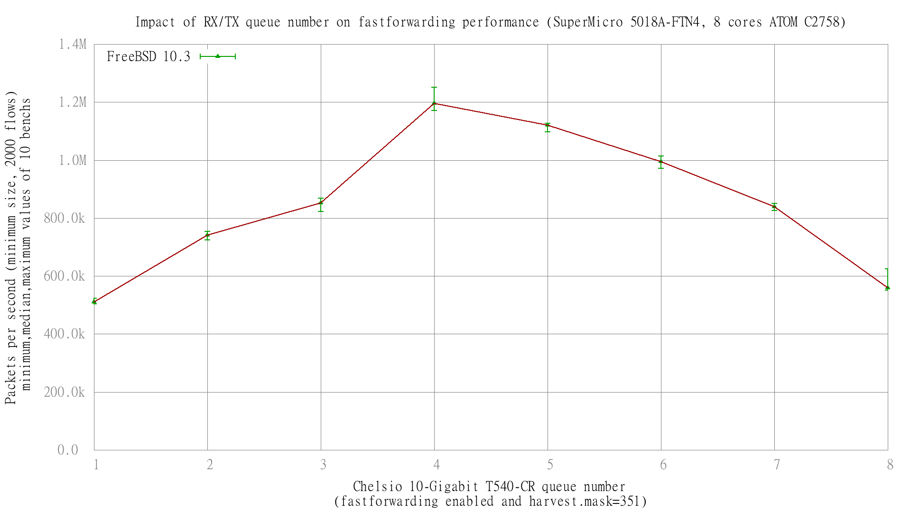

Impact of random.harvest.mask and Chelsio rx/tx queue number on fastforwarding performance
  - SuperMicro SuperServer 5018A-FTN4 (8 cores Atom C2758 at 2.4GHz)
  - Quad port Chelsio 10-Gigabit T540-CR and OPT SFP (SFP-10G-LR)
  - FreeBSD 10.3
  - 2000 flows of smallest UDP packets
  - 2 static routes
  - ntxq10g and nrxq10g = 1, 2, 3, 4, 5, 6, 7 and 8 (=number of core=default on this setup)
  - Traffic load at 14.88 Mpps

