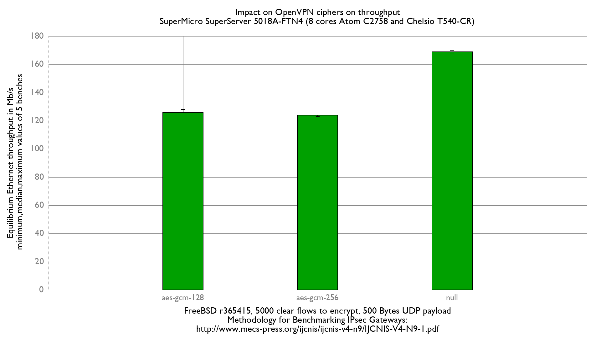

Impact of cyphers on OpenVPN performance
  - SuperMicro SuperServer 5018A-FTN4 (8 cores Atom C2758 at 2.4GHz)
  - Quad port Chelsio 10-Gigabit T540-CR (10Giga DAC cable)
  - FreeBSD 13-head r365415
  - OpenVPN 2.4.9
  - 5000 flows of clear UDP packets
  - 500Bytes UDP load => packet size: 528B => Ethernet frame size:542B

