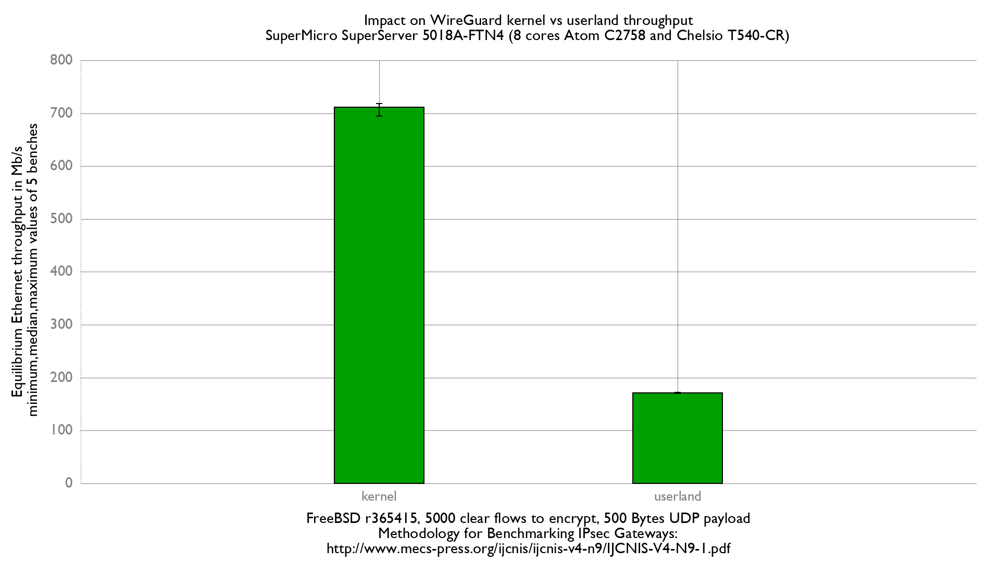

WireGuard kernel vs userland
  - SuperMicro SuperServer 5018A-FTN4 (8 cores Atom C2758 at 2.4GHz)
  - Quad port Chelsio 10-Gigabit T540-CR (10Giga DAC cable)
  - FreeBSD 13-head r365415
  - Wireguard kernel: D26137
  - Wireguard userland: 1.0.20200827
  - 5000 flows of clear UDP packets
  - 500Bytes UDP load => packet size: 528B => Ethernet frame size:542B

```
x Wireguard userland: Equilibrium Ethernet throughput in Mb/s
+ Wireguard kernel: Equilibrium Ethernet throughput in Mb/s
+--------------------------------------------------------------------------+
|x                                                                       ++|
|x                                                                     + ++|
|A                                                                         |
|                                                                       |A||
+--------------------------------------------------------------------------+
    N           Min           Max        Median           Avg        Stddev
x   5           170           172           171         171.2    0.83666003
+   5           695           718           711           710     9.2195445
Difference at 95.0% confidence
	538.8 +/- 9.54695
	314.72% +/- 5.93396%
	(Student's t, pooled s = 6.54599)
```



