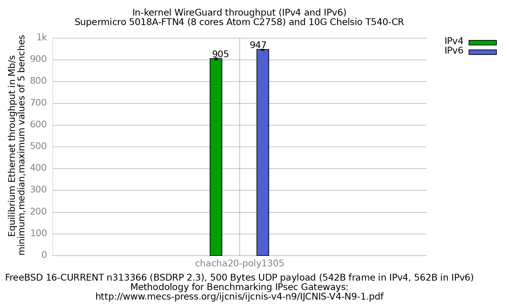

In-kernel WireGuard performance (IPv4 and IPv6)
  - SuperMicro SuperServer 5018A-FTN4 (8 cores Atom C2758 at 2.4GHz), DUT = sm1
  - Quad port Chelsio 10-Gigabit T540-CR
  - FreeBSD 16-CURRENT n313366 (BSDRP 2.3)
  - In-kernel WireGuard, `if_wg(4)`, configured by wireguard-tools 1.0.20260223
  - ChaCha20-Poly1305 (the only cypher WireGuard has)
  - 5000 flows of clear UDP packets
  - LRO disabled on both DUT interfaces
  - 500Bytes UDP load => 542B Ethernet frame in IPv4, 562B in IPv6



```
                     IPv4   IPv6
Mb/s (median of 5)    905    947
kpps                208.7  210.6
```

Per-iteration values, IPv4: 906, 899, 905, 908, 901.
IPv6: 943, 947, 948, 947, 943.

## IPv6 is not faster, the frames are bigger

IPv6 measures 4.6% more Mb/s than IPv4. As on the APU2 run of this bench, that
is the unit and not the result: the same 500B UDP payload travels in a 542B
frame in IPv4 and a 562B frame in IPv6, so at equal packet rate IPv6 counts
more bytes. In packets per second the two are 208.7 kpps and 210.6 kpps, a
0.9% difference.

`if_wg(4)` therefore forwards the same number of packets per second whichever
address family is used, which matches what the APU2 bench found on entirely
different hardware.

**Caveat on the flow count.** The `equilibrium` of this run hardcoded a
different number of flows per address family: 71 x 70 = 4970 in IPv4 against
20 x 100 = 2000 in IPv6. Flow count drives the RSS queue spread on the DUT,
so the two arms were not identical tests. The conclusion above is the one that
survives that difference rather than one produced by it: the packet rates
agree to 0.9% despite a 2.5x difference in flows. Read it as "flow count in
this range does not move `if_wg(4)` packet rate either", not as a clean
matched comparison. `equilibrium` now defaults to 2000 flows in both families.

That reading has since been confirmed directly on this same DUT. The IPsec
VTI bench was re-run at a matched 2000 flows in both families and compared
against its own ~4970-flow IPv4 arm: the unimodal cyphers moved by 1.3%
(null 2062 to 2036, aes-cbc-128 920 to 908). See
[`../../../ipsec/results/fbsd16-n313366.BSDRP.2.3/`](../../../ipsec/results/fbsd16-n313366.BSDRP.2.3/README.md).
So this set was not re-run: the flow mismatch is real but demonstrably does
not move the packet rate on this hardware at these rates.

## Comparison with the previous result set

```
                         fbsd13-r365415   fbsd16-n313366   ratio
kernel WireGuard, IPv4         711 Mb/s         905 Mb/s    x1.27
```

Same DUT hardware (Atom C2758 + T540-CR) and the same equilibrium method, so
the 27% gain is plausible as a FreeBSD 13 to 16 improvement. It is **not** a
clean like-for-like comparison, and three differences matter:

- **The generator and the endpoint changed.** The old run used an r630 as
  packet generator, with Chelsio `vcxl` VI interfaces, and an HP box as the
  tunnel endpoint. Neither is in the lab any more. This run generates from
  sm2 (Atom C2758, Intel X520) and terminates the tunnel on bigone
  (EPYC 7502P). None of the three is the bottleneck here (see below), but the
  path is not the same one.
- **The declared link rate differs**: `-l 2000` here against `-l 10000`
  before. See the next section, this is not cosmetic.
- The old result set also measured a userland arm (71 Mb/s). BSDRP 2.3 ships
  no `wireguard-go`, so that comparison is not reproducible and only the
  kernel figure is reported.

## -l 2000, and why -l 10000 gives a wrong answer here

`equilibrium` opens its binary search by offering **half** the declared link
rate. With `-l 10000` the first offer is 5000 Mb/s, roughly 5.5x what this DUT
forwards. Under that overload the DUT delivers ~250 Mb/s, and equilibrium's
"forwarding rate too low" recovery then clamps the whole search:

```
STEP=$(( FWRATE / 2 ))
OLOAD=${FWRATE}
```

From there the search can only climb by halving steps from 250, and the
convergence test fires long before the real capacity. Replaying the search
arithmetic reproduces the observed path exactly: 252, 315, 346, 361, 368 Mb/s,
converging at **367 Mb/s** — a 2.5x under-report that looks like a large
regression against the 711 Mb/s of FreeBSD 13.

`-l 2000` opens at 1000 Mb/s, just above the DUT's ceiling, so the clamp never
triggers and the search descends normally. `-l` only sets the starting point
of the search; it declares nothing physical and the link is still 10G.

Cross-checked by hand: with the receiver armed and 200000 pps of 542B frames
offered, the receiver counts 200071 pps with no loss (867 Mb/s), and the DUT
saturates above ~1080 Mb/s. That agrees with the 905 Mb/s equilibrium result
and not with 367.

## Three lab problems that produced 0 Mb/s iterations

All three made an iteration report `Measured forwarding rate = 0` followed by
`ERROR: FWRATE lower than 1 Mb/s, can't continue`, which kills the run. They
are recorded here because none of them is visible from the result files alone.

**1. The installed `equilibrium` was older than the BSDRP sources.** The image
on sm2 still did `ifconfig <tx> down / txcsum / up` on *every* search step,
with no settle delay. Combined with the receiver's own netmap attach, each
step raced 2-4s of link renegotiation, so traffic stopped partway through the
30s window: the receiver log shows ~10 good seconds then a long tail of 1 pps,
whose median is 1 pps. The current source
(`~/BSDRP/BSDRP/Files/usr/local/bin/equilibrium`) already fixes this, and also
replaces `pkill pkt-gen` (which kills unrelated receivers) with a kill by PID.
Diff a lab node's tooling against the BSDRP sources before debugging it.

**2. The switch forgets the receiver's MAC.** The three nodes are not directly
cabled: they meet on a VLAN switch, one VLAN per hop. A netmap attach bounces
the link, the switch flushes that port's learned MAC on link-down, and a
netmap receiver never transmits, so nothing ever refreshes the entry. The
switch then stops delivering frames to it. Raising `mac-address-table
aging-time` does not help (it was already 100000s) and pinging beforehand does
not survive the bounce. Fixed with static MAC entries for all six bench ports.

**3. IPv6 additionally needs a permanent NDP entry.** The static MAC entries
fix "which port is this MAC on"; they do not fix "which MAC has this IP". The
peer resolved the receiver by NDP, forwarded for ~8 seconds, then the entry
went STALE and the receiver — in netmap mode — could not answer the neighbour
solicitation. Fixed with `static_ndp_*` (and matching `static_arp_*`) on the
peer, archived in `../../lab/refendpoint/`.

## Checking the tunnel was really used

`BEFORE_CMD` and `AFTER_CMD` bracket every bench with `wg show`,
`netstat -I wg0 -b` and the Chelsio frame counters, kept in `RAW/*.before` and
`RAW/*.after`. Every iteration of this result set encrypted ~39.6 million
packets through `wg0` with 2 output errors, which is what proves the DUT
encrypted the traffic rather than plain-forwarding it. A throughput figure
alone cannot tell those apart.

## Raw data

`RAW/` holds the per-iteration equilibrium output, `bench.inet4.*` and
`bench.inet6.*`, plus the `*.before` / `*.after` captures. The
`inet4.chacha20-poly1305.equilibrium` / `inet6.*` files are the 5 equilibrium
values per address family, `*.equilibrium.max` the maximum value seen during
each search. `gnuplot.data[.max]` is their ministat aggregation, and
`inet4.data` / `inet6.data` are the per-family split used to draw the
histogram.
