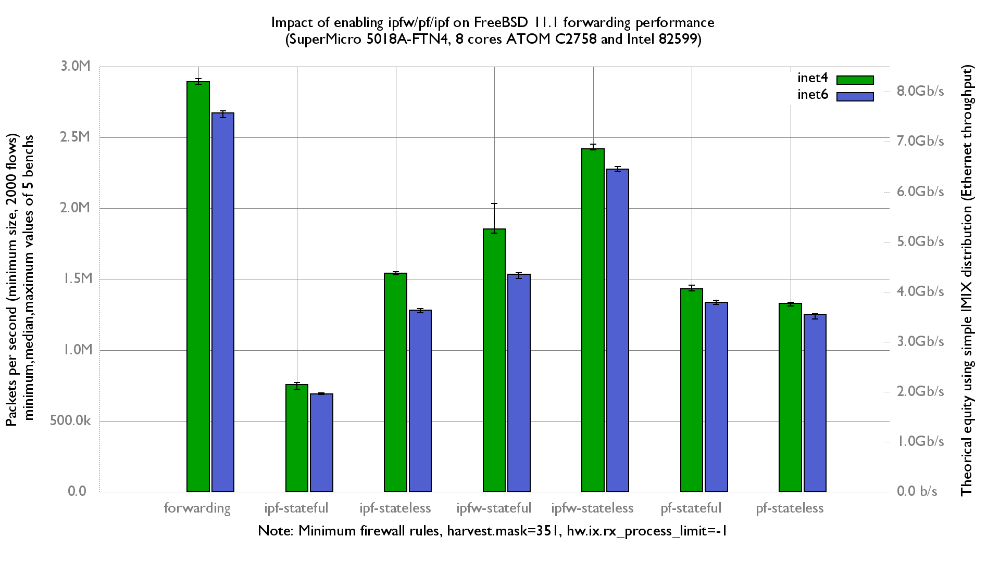

Impact of ipfw/pf/ipf on forwarding performance
  - SuperMicro SuperServer 5018A-FTN4 (8 cores Atom C2758 at 2.4GHz)
  - Dual port 10-Gigabit Intel 82599 and OPT SFP (SFP-10G-LR)
  - FreeBSD 11.1
  - 2000 flows of smallest UDP packets
  - 2 static routes
  - Traffic load at 14.88 Mpps
  - harvest.mask=351

