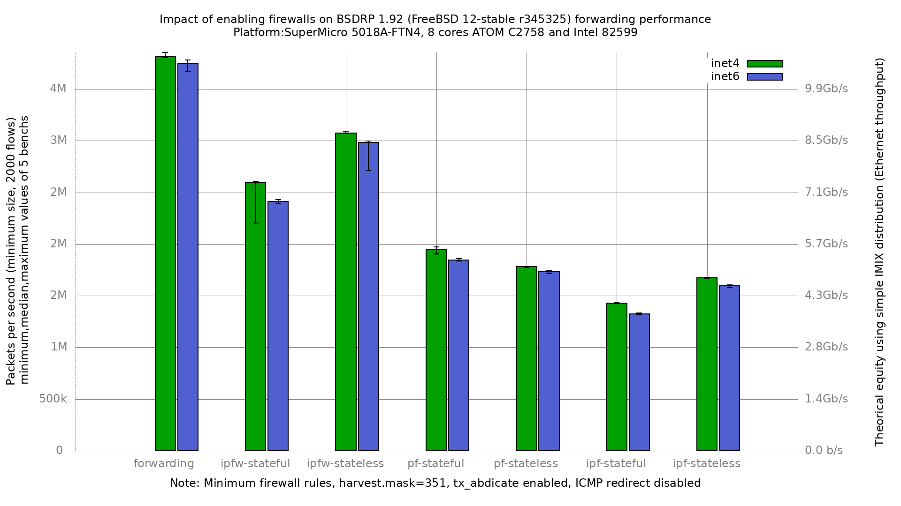

Impact of ipfw/pf/ipf on forwarding performance
  - SuperMicro SuperServer 5018A-FTN4 (8 cores Atom C2758 at 2.4GHz)
  - Dual port Intel Intel 82599
  - BSDRP 1.92 (FreeBSD 12-stable r345325)
  - 2000 flows of smallest UDP packets
  - 2 static routes
  - Traffic load at 14.88 Mpps
  - harvest.mask=351
  - net.inet.ip.redirect=0
  - net.inet6.ip6.redirect=0
  - txabdicate enabled

