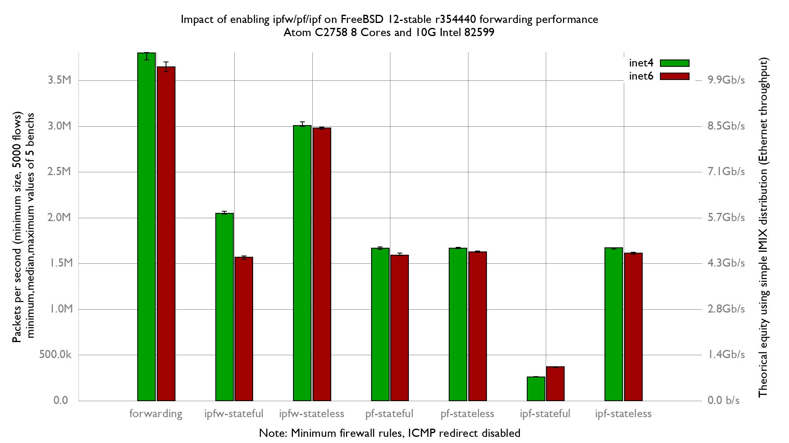

Impact of ipfw/pf/ipf on forwarding performance
  - SuperMicro SuperServer 5018A-FTN4 (8 cores Atom C2758 at 2.4GHz)
  - Dual port Intel Intel 82599
  - FreeBSD 12-stable r354440 (BSDRP 1.96)
  - 5000 flows of smallest UDP packets
  - 2 static routes
  - Traffic load at 14.88 Mpps
  - ICMP redirect disabled

