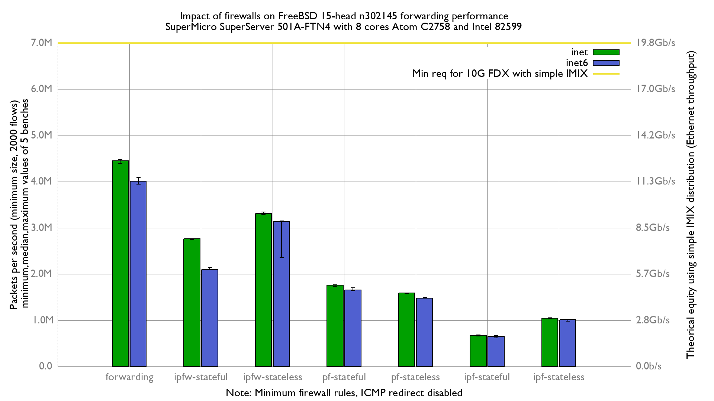

# Impact of firewalls on forwarding performance
Lab:
  - SuperMicro SuperServer 5018A-FTN4 (8 cores Atom C2758 at 2.4GHz)
  - Dual port Intel Intel 82599
  - FreeBSD 15-head n302145 (e69573bc2be)
  - 2000 flows of smallest UDP packets
  - 2 static routes
  - Traffic load at 12 Mpps
  - harvest.mask=351
  - net.inet.ip.redirect=0
  - net.inet6.ip6.redirect=0
  - txabdicate enabled

# Results

## Graph

## flamegraph

### inet

  - [forwarding: inet](bench.forwarding.inet4.svg)
  - [ipfw-stateless: inet](bench.ipfw-stateless.inet4.svg)
  - [ipfw-stateful: inet](bench.ipfw-stateful.inet4.svg)
  - [pf-stateless: inet](bench.pf-stateful.inet4.svg)
  - [pf-stateful: inet](bench.pf-stateless.inet4.svg)
  - [ipf-stateless: inet](bench.ipf-stateless.inet4.svg)
  - [ipf-stateful: inet](bench.ipf-stateful.inet4.svg)

## inet6

  - [forwarding: inet6](bench.forwarding.inet6.svg)
  - [ipfw-stateless: inet6](bench.ipfw-stateless.inet6.svg)
  - [ipfw-stateful: inet6](bench.ipfw-stateful.inet6.svg)
  - [pf-stateless: inet6](bench.pf-stateless.inet6.svg)
  - [pf-stateful: inet6](bench.pf-stateful.inet6.svg)
  - [ipf-stateless: inet6](bench.ipf-stateful.inet6.svg)
  - [ipf-stateful: inet6](bench.ipf-stateless.inet6.svg)
