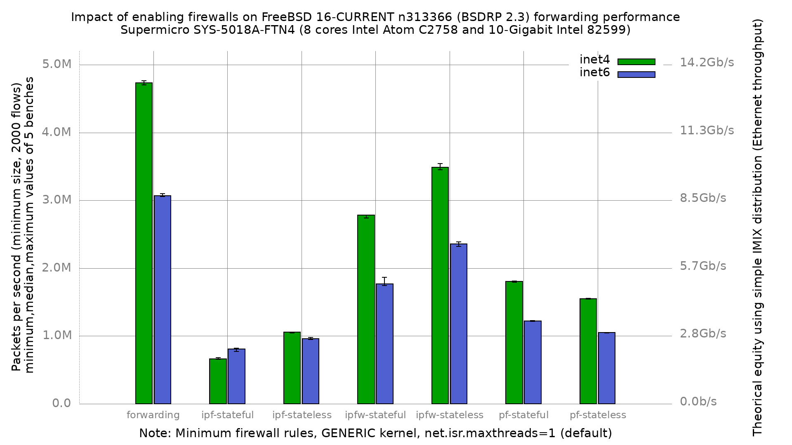

# Impact of firewalls on forwarding performance

Lab:
  - SuperMicro SuperServer 5018A-FTN4 (8 cores Atom C2758 at 2.4GHz)
  - Dual port Intel 82599 (10-Gigabit)
  - FreeBSD 16-CURRENT n313366 (BSDRP 2.3)
  - GENERIC kernel
  - 2000 flows of smallest UDP packets
  - 2 static routes
  - Traffic load at 14.88 Mpps (10-Gigabit line rate, 60 B frames)
  - tx_abdicate enabled, 1024 tx/rx descriptors, flow control disabled
  - net.isr.maxthreads=1 (default)
  - 5 iterations per data point, reboot between each

# Results

## Graph

Median values (pps):

| configuration  | inet4   | inet6   |
|----------------|---------|---------|
| forwarding     | 4729215 | 3067944 |
| ipf-stateful   | 663534  | 809104  |
| ipf-stateless  | 1055472 | 962341  |
| ipfw-stateful  | 2780069 | 1769754 |
| ipfw-stateless | 3487345 | 2358686 |
| pf-stateful    | 1804530 | 1220113 |
| pf-stateless   | 1548077 | 1048978 |

Spread (max-min over median) is under 1.6% on eight of the fourteen data
points and under 3.4% on all but two: ipfw-stateful inet6 (6.8%) and
ipf-stateful inet6 (6.4%) are the noisy ones, and the min/max bars in the
graph show it.

## Observations

The offered load (14.88 Mpps) is about 3x what the DUT can forward, so every
number here is the Atom's own ceiling and not a generator limit.

ipfw is the fastest of the three firewalls in both modes: stateless
3.49 Mpps (26% below plain forwarding), stateful 2.78 Mpps. ipf is the
slowest in stateful mode (664 Kpps, an 86% drop from plain forwarding), and
pf sits between the two. That ranking matches the APU2 measurement on the
same FreeBSD revision.

**pf-stateful is faster than pf-stateless** (1804530 vs 1548077 on inet4,
+16.6%; +16.3% on inet6). This is not noise: pf-stateless has the tightest
spread in the whole run (0.47% inet4) and pf-stateful is at 1.01%. It is
also not new on this platform — every prior Atom result set in this
directory shows the same inversion (n302145: 1756500 vs 1590883; c276570:
2272766 vs 2135483). The mechanism is that the `no state` ruleset is
evaluated in full for every packet, while a stateful match short-circuits on
the state table.

**ipf-stateful is the one configuration where inet6 beats inet4** (809104 vs
663534, +22%). State lookup dominates that configuration, so the larger IPv6
header stops being the limiting factor. Every other configuration costs 9 to
36% going from inet4 to inet6.

## Version delta against `fbsd15-n302145`

| configuration  | n302145 inet4 | n313366 inet4 | delta  | n302145 inet6 | n313366 inet6 | delta  |
|----------------|---------------|---------------|--------|---------------|---------------|--------|
| forwarding     | 4449011       | 4729215       | +6.3%  | 4007419       | 3067944       | -23.4% |
| ipf-stateful   | 673347        | 663534        | -1.5%  | 651812        | 809104        | +24.1% |
| ipf-stateless  | 1048303       | 1055472       | +0.7%  | 1011005       | 962341        | -4.8%  |
| ipfw-stateful  | 2761103       | 2780069       | +0.7%  | 2099391       | 1769754       | -15.7% |
| ipfw-stateless | 3313788       | 3487345       | +5.2%  | 3130936       | 2358686       | -24.7% |
| pf-stateful    | 1756500       | 1804530       | +2.7%  | 1654973       | 1220113       | -26.3% |
| pf-stateless   | 1590883       | 1548077       | -2.7%  | 1480963       | 1048978       | -29.2% |

**This delta is not a clean version comparison. Read the caveat below before
using it.**

inet4 is essentially flat (-2.7% to +6.3%), but **inet6 regressed in six of
seven configurations**, by 15 to 29%. ipf-stateful is the sole exception.

### Caveat: the baseline is not config-identical

The `fbsd15-n302145` README documents `harvest.mask=351`,
`net.inet.ip.redirect=0` and `net.inet6.ip6.redirect=0`. Neither setting is
present in this repository's `configs/forwarding` config-set, and neither was
applied in this run — the DUT ran with `net.inet.ip.redirect=1` (the
default). So part of the delta above is tuning, not FreeBSD version.

Bounding the redirect part: this machine's own
[`icmp_drop_redirect`](../../../icmp_drop_redirect/results/fbsd15-n302432/)
bench measured 4732260 pps with redirects dropped against 4667793 with them
on — **1.4%, with overlapping min/max**. That is far too small to account for
a 23 to 29% inet6 regression. `harvest.mask` is not bounded by any
measurement in this archive and remains an uncontrolled variable.

The inet6 regression is therefore real in magnitude but not yet attributed.
Isolating it needs a run of n302145 and n313366 under identical config, which
this result set does not provide.

### Why inet4 and inet6 diverge

On n302145 inet6 cost only 10% against inet4 (4007419 vs 4449011). On
n313366 it costs 35% (3067944 vs 4729215). The IPv6 forwarding path lost
ground relative to IPv4 between these two revisions, and the effect is
visible across every firewall configuration rather than in one of them, which
points at the shared v6 path rather than at any single firewall.

## CPU profiling (hwpmc / flamegraph)

Profiled each configuration with `hwpmc` while forwarding IPv4 60 B frames
(event `cpu_clk_unhalted.core_p`), rendered as flamegraphs under
[`PMC/`](PMC/) together with the folded call graphs.

| configuration  | offered   | non-idle samples | cycles in firewall | top frame         | flamegraph |
|----------------|-----------|------------------|--------------------|-------------------|------------|
| forwarding     | 1900 Kpps | 110891           | 0.0%               | `iflib_encap`     | [svg](PMC/forwarding.svg) |
| ipf-stateful   | 200 Kpps  | 73692            | 44.3%              | `ipf_matchsrcdst` | [svg](PMC/ipf-stateful.svg) |
| ipf-stateless  | 420 Kpps  | 10634            | 13.7%              | `lock_delay`      | [svg](PMC/ipf-stateless.svg) |
| ipfw-stateful  | 1100 Kpps | 25632            | 15.5%              | `ipfw_chk`        | [svg](PMC/ipfw-stateful.svg) |
| ipfw-stateless | 1400 Kpps | 92616            | 15.4%              | `ipfw_chk`        | [svg](PMC/ipfw-stateless.svg) |
| pf-stateful    | 720 Kpps  | 16923            | 19.4%              | `pf_find_state`   | [svg](PMC/pf-stateful.svg) |
| pf-stateless   | 620 Kpps  | 20283            | 20.4%              | `pf_test`         | [svg](PMC/pf-stateless.svg) |

"cycles in firewall" is the share of non-idle samples whose stack passes
through `pfil_*`, `ipf_*`/`fr_check`, `ipfw_chk`/`ipfw_check_packet` or
`pf_test`. The `forwarding` set measuring exactly 0.0% is the control: no
firewall is loaded, so no such frame can appear.

### Read the percentages within a configuration, not across them

The offered rate differs per configuration — each was set to roughly 40% of
that configuration's own median from the table above — so the firewall shares
are **not** comparable between rows. Per-packet firewall work is a larger
fraction of a lighter total load. ipf-stateful's 44.3% at 200 Kpps does not
mean ipf is three times more expensive than ipfw at 15.5% / 1100 Kpps.

The one comparison that does hold is the pf pair, which ran at similar rates
(720 vs 620 Kpps): **pf-stateless spends 20.4% of non-idle cycles in
`pf_test` against pf-stateful's 19.4%**, and pf-stateful's top frame is
`pf_find_state` rather than `pf_test`. The `no state` ruleset is evaluated in
full for every packet, while a stateful match short-circuits on the state
table — the mechanism behind pf-stateful's higher throughput measured above.

### Capture notes

A full-rate capture is not usable on this hardware: at 14.88 Mpps offered the
8 cores are pinned, userland `pmcstat` starves and hwpmc overflows its
per-CPU buffers. All profiles here were taken sub-saturation with `pkt-gen
-R`, with `pmcstat` driven mid-blast once the rate was steady. Every capture
retained here has receiver pps equal to offered pps (no DUT loss) — verified
per capture, since a capture where the receiver trails the sender is
saturated and worthless regardless of window placement.

Even at 40% of median this Atom reports only 0.1 to 1.1% idle, well below the
32-58% idle range seen on lighter platforms. There were no hwpmc discard
warnings and the forwarding path is on top of every profile, so the cycle
proportions are sound, but there is little headroom left at these rates.

`ipf-stateless` is the weakest capture in the set: 10634 non-idle samples
against 16k-110k elsewhere, and its top frame is `lock_delay` rather than an
ipf function. Treat its 13.7% as indicative only.

hwpmc is not in `/boot/loader.conf` on this image, so it must be loaded after
every reboot before `pmcstat` will run.
