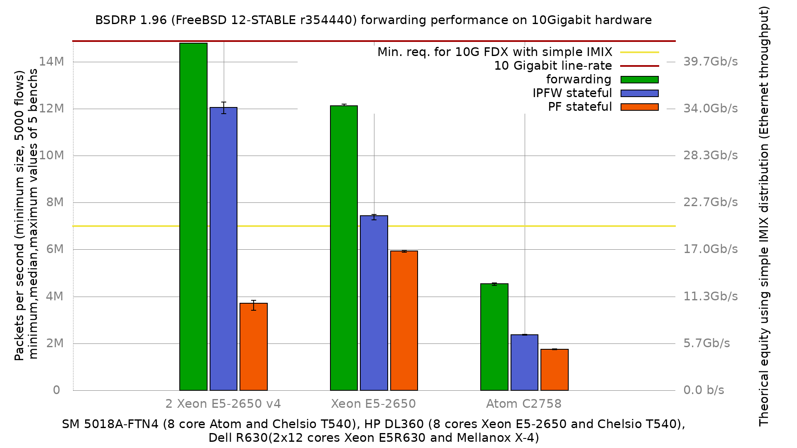
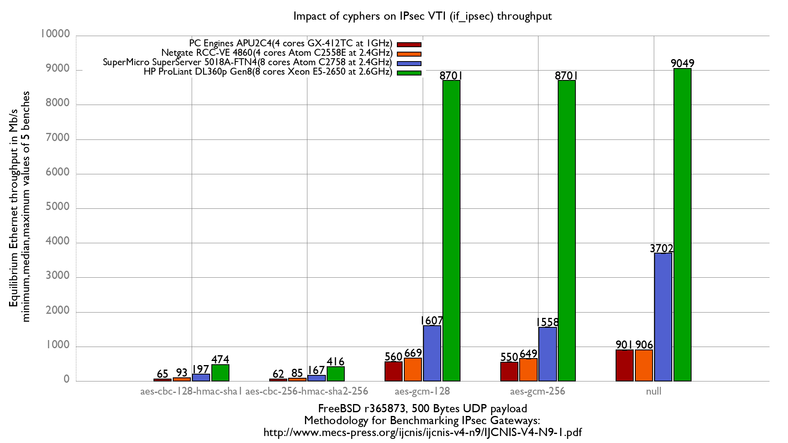
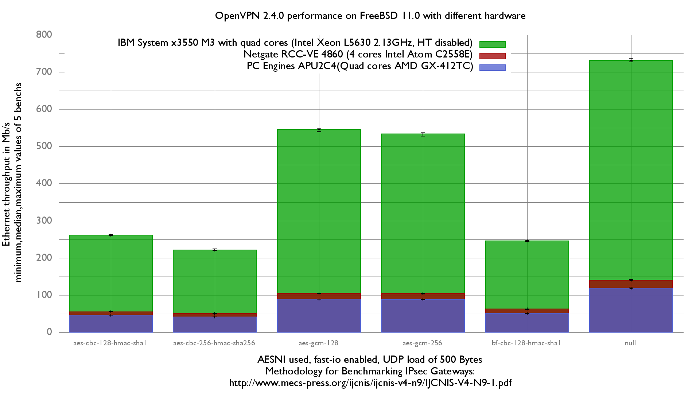

# netbenches
FreeBSD network forwarding performance benchmark results

This repository includes bench scripts (need netmap pkt-gen and nanobsd like), bench configuration files, raw results and gnuplot graphs on few setups.
[Bench script documentation is available too](doc/README.md).

Hardware benched are:
 - Dell PowerEdgre R630 (2x12 cores Intel Xeon E5-2650 @ 2.2GHz) and: Intel 82599, Chelsio T520-CR, Mellanox ConnectX-3 and ConnectX-4
 - HP ProLiant DL360p Gen8 (8 cores Intel Xeon E5-2650 @ 2.60GHz) and 10-Gigabit Chelsio T540-CR
 - SuperMicro SuperServer 5018A-FTN4 (8 cores Atom C2758) and 10-Gigabit Chelsio T540-CR
 - SuperMicro SuperServer 5018A-FTN4 (8 cores Atom C2758) and 10-Gigabit Intel 82599
 - Netgate RCC-VE 4860 (4 cores Intel Atom C2558) and quad port Intel i350 (the 2 Intel i211 are not benched)
 - PC Engines APU2C4 (4 cores AMD GX-412TC) and 4 Intel i210AT Gigabit NIC

Some results:
 - ipfw/pf/ipf's impact on forwarding performance:
    - [Impact of firewalls on forwarding performance with 2x12 cores Xeon E5-2650 & Mellanox ConnectX-4](Xeon_E5-2650-2x12Cores-Mellanox_ConnectX-4/forwarding-pf-ipfw/results/fbsd12.r328085.BSDRP/README.md)
    - [Impact of firewalls on forwarding performance with 8 cores Xeon E5-2650 & Chelsio T540](Xeon_E5-2650-8Cores-Chelsio_T540-CR/forwarding-pf-ipfw/results/fbsd11.1-yandex/README.md)
    - [Impact of firewalls on forwarding performance with 8 cores Atom C2758 & Chelsio T540](Atom_C2758_8Cores-Chelsio_T540-CR/forwarding-pf-ipfw/results/fbsd11.1-yandex/README.md)
    - [Impact of firewalls on forwarding performance with 8 cores Atom C2758 & Intel 82599](Atom_C2758_8Cores-Intel_82599/forwarding-pf-ipfw/results/fbsd12-stable.r345325.BSDRP.1.92/README.md)
    - [Impact of firewalls on forwarding performance with 4 cores Atom C2558 & Intel i350](Atom_C2558_4Cores-Intel_i350/forwarding-pf-ipfw/results/fbsd12-stable.r345325.BSDRP.1.92/README.md)
    - [Impact of firewalls on forwarding performance with 4 cores AMD GX-412TC & Intel i210](AMD_GX-412TC_4Cores_Intel_i210AT/forwarding-pf-ipfw/results/fbsd12-stable.r345325.BSDRP.1.92/README.md)
    - [(old)Impact of firewalls on forwarding performance with 4 cores Xeon L5630](Xeon_L5630-4Cores-Intel_82599EB/forwarding-pf-ipfw/results/fbsd11-stable.r312663/README.md)
    - [(old)Impact of firewalls on forwarding performance with 2 cores AMD G-T40E](AMD_G-T40E_2Cores_RTL8111E/forwarding-pf-ipfw/results/fbsd11-stable.r312663//README.md)
    - [One year (2017) of forwarding performance with 8 cores Xeon E5-2650 & Chelsio T540](Xeon_E5-2650-8Cores-Chelsio_T540-CR/forwarding-pf-ipfw/results/fbsd.2017/README.md)
    - [One year (2017) of forwarding performance with 4 cores Atom 2558 & Intel i350](Atom_C2558_4Cores-Intel_i350/forwarding-pf-ipfw/results/fbsd.2017/README.md)
    - [One year (2016) of forwarding performance with 8 cores Atom 2758 & Chelsio T540](Atom_C2758_8Cores-Chelsio_T540-CR/forwarding-pf-ipfw/results/fbsd.2016/README.md)
    - [One year (2016) of forwarding performance with 4 cores Atom 2558 & Intel i350](Atom_C2558_4Cores-Intel_i350/forwarding-pf-ipfw/results/fbsd.2016/README.md)
    - [One year (2016) of forwarding performance with 4 cores AMD GX-412TC & Intel i210](AMD_GX-412TC_4Cores_Intel_i210AT/forwarding-pf-ipfw/results/fbsd.2016/README.md)
    - [One year (2015) of fastforwarding performance evolution with with 8 cores Xeon E5-2650](Xeon_E5-2650-8Cores-Chelsio_T540-CR/forwarding-pf-ipfw/results/fbsd11-head.2015/README.md)
    - [One year (2015) of fastforwarding performance evolution with 4 cores Atom C2558](Atom_C2558_4Cores-Intel_i350/forwarding-pf-ipfw/results/fbsd11-head.2015/README.md)

 - comparing 12-head and 11-stable:
    - [fbsd12-head vs 11-stable r318516 with 4 cores AMD GX-412TC](AMD_GX-412TC_4Cores_Intel_i210AT/forwarding-pf-ipfw/results/fbsd12-head-vs-11-stable.r318516/README.md)
 - comparing 11.0 and 11.1-BETA1:
    - [FreeBSD 11.0 vs 11.1-BETA1 on a 8 cores Xeon E5-2650 with Chelsio T540](/Xeon_E5-2650-8Cores-Chelsio_T540-CR/forwarding-pf-ipfw/results/fbsd11.0vs11.1/README.md)
    - [FreeBSD 11.0 vs 11.1-BETA1 on a 4 cores AMD GX-412TC with Intel i210](AMD_GX-412TC_4Cores_Intel_i210AT/forwarding-pf-ipfw/results/fbsd11.0vs11.1/README.md)
 - Impact of entropy sources:
    - [Impact of random.harvest.mask on forwarding performance with 8 cores Xeon E5-2650](Xeon_E5-2650-8Cores-Chelsio_T540-CR/kern.random.harvest.mask/results/fbsd11.1/README.md)
    - [Impact of random.harvest.mask on forwarding performance with 8 cores Atom C2758](Atom_C2758_8Cores-Chelsio_T540-CR/kern.random.harvest.mask/results/fbsd11.1/README.md)
    - [Impact of random.harvest.mask on forwarding performance with 4 cores Atom C2558](Atom_C2558_4Cores-Intel_i350/kern.random.harvest.mask/results/fbsd11.1/README.md)
    - [Impact of random.harvest.mask on forwarding performance with 4 cores AMD GX-412TC](AMD_GX-412TC_4Cores_Intel_i210AT/kern.random.harvest.mask/results/fbsd11.1/README.md)
 - Impact of adding VIMAGE support (without using it):
    - [Impact of adding VIMAGE on forwarding/pf/ipfw performance with 8 cores Xeon E5-2650](Xeon_E5-2650-8Cores-Chelsio_T540-CR/forwarding-pf-ipfw/results/fbsd11.1-yandex.VIMAGE/README.md)
    - [Impact of adding VIMAGE on forwarding/pf/ipfw performance with 8 cores Atom C2758](Atom_C2758_8Cores-Chelsio_T540-CR/forwarding-pf-ipfw/results/fbsd12-head.r317849.VIMAGE/README.md)
    - [Impact of adding VIMAGE on forwarding/pf/ipfw performance with 4 cores Atom C2558](Atom_C2558_4Cores-Intel_i350/forwarding-pf-ipfw/results/fbsd12-head.r317849.VIMAGE/README.md)
    - [Impact of adding VIMAGE on forwarding/pf/ipfw performance with 4 cores AMD GX-412TC](AMD_GX-412TC_4Cores_Intel_i210AT/forwarding-pf-ipfw/results/fbsd12-head.r317849.VIMAGE/README.md)
    - [Impact of adding VIMAGE on forwarding/pf/ipfw performance with 4 cores Xeon L5630](Xeon_L5630-4Cores-Intel_82599EB/forwarding-pf-ipfw/results/fbsd12-head.r317849.VIMAGE/README.md)
 - Impact of Intel's TurboBoost
    - [Impact of TurboBoost on forwarding performance with 8 cores Atom C2758 & Chelsio T540](Atom_C2758_8Cores-Chelsio_T540-CR/TurboBoost/results/fbsd11-stable-r327668.BSDRP/README.md)
    - [Impact of TurboBoost on forwarding performance with 8 cores Atom C2758 & Intel 82599](Atom_C2758_8Cores-Intel_82599/TurboBoost/results/fbsd11-stable-r327668.BSDRP/README.md)
 - Impact of a software bridge
    - [Impact of an if_bridge on forwarding performance with 8 cores cores Xeon E5-2650](Xeon_E5-2650-8Cores-Chelsio_T540-CR/bridge/results/fbsd11.1-yandex/README.md)
    - [Impact of an if_bridge on forwarding performance with 8 cores Atom C2758 & Chelsio T540](Atom_C2758_8Cores-Chelsio_T540-CR/bridge/results/fbsd11.1-yandex/README.md)
 - Impact of enabling ALTQ
    - [Impat of enabling ALTQ on forwarding performance with 4 cores Atom C2558](Atom_C2558_4Cores-Intel_i350/forwarding-pf-ipfw/results/fbsd11-stable.r332393.ALTQ/README.md)
    - [Impat of enabling ALTQ on forwarding performance with 4 cores AMD GX-412TC](AMD_GX-412TC_4Cores_Intel_i210AT/forwarding-pf-ipfw/results/fbsd11-stable.r332393.ALTQ/README.md)
 - Impact of number of static routes:
    - [Impact of number of static routes on forwarding performance with 4 cores Xeon L5630](Xeon_L5630-4Cores-Intel_82599EB/route-contention/results/fbsd10.2/README.md)
 - Mellanox ConnectX-4 tuning:
    - [Impact of queue number on forwarding performance with 2x12 cores Xeon E5-2650](Xeon_E5-2650-2x12Cores-Mellanox_ConnectX-4/dev.mce.conf.channels/results/fbsd11.1-yandex/README.md)
 - Chelsio NIC T540-CR tuning:
    - [Impact of queue number on forwarding performance with 8 cores Xeon E5-2650](Xeon_E5-2650-8Cores-Chelsio_T540-CR/nXxq10g/results/fbsd11-stable.r312663/README.md)
    - [Impact of queue number on forwarding performance with 8 cores Atom C2758](Atom_C2758_8Cores-Chelsio_T540-CR/hw.cxgbe.nXxq10g/results/fbsd11.1/README.md)
    - [Impact of disabling cxgbe.toecaps_allowed on forwarding performance with 8 cores Xeon E5-2650](Xeon_E5-2650-8Cores-Chelsio_T540-CR/hw.cxgbe.Xcaps_allowed/results/fbsd11.1-yandex/README.md)
    - [Impact of pinning IRQ queue to CPU with 8 cores Xeon E5-2650](Xeon_E5-2650-8Cores-Chelsio_T540-CR/chelsio-bind-cpu/results/fbsd11.1-yandex/README.md)
    - [Impact of pinning IRQ queue to CPU with 8 cores Atom C2758](Atom_C2758_8Cores-Chelsio_T540-CR/chelsio-bind-cpu/results/fbsd11.1-yandex/README.md)
 - Intel 82599EB NIC tuning:
    - [Impact of Intel 82599EB queue number (1 queue per core) on forwarding performance with 4 cores Xeon L5630](Xeon_L5630-4Cores-Intel_82599EB/ix.num_queues/results/fbsd11-routing.r287531/README.md)
    - [Impact of random.harvest.mask and Intel 82599EB queue number (1 queue per core) on forwarding performance with 4 cores Xeon L5630](Xeon_L5630-4Cores-Intel_82599EB/ix.num_queues.random.harvest.mask.351/results/fbsd11-routing.r287531/README.md)
	- [Impact of Intel 82599EB AIM on forwarding performance with 4 cores Xeon L5630](Xeon_L5630-4Cores-Intel_82599EB/ix.enable_aim/results/fbsd10.2/README.md)
    - [Impact of Intel 82599EB Rx|Tx process limit on forwarding performance with 4 cores Xeon L5630](Xeon_L5630-4Cores-Intel_82599EB/Xx_process_limit/results/fbsd10.2/README.md)
    - [Impact of Intel 82599EB descriptors per queue on forwarding performance with 4 cores Xeon L5630](Xeon_L5630-4Cores-Intel_82599EB/ix.Xxd/results/fbsd10.2/README.md)
    - [Impact of AIM on Intel 82599EB](Xeon_L5630-4Cores-Intel_82599EB/Intel.aim/results/fbsd11-stable.r312663/README.md)
 - Hyper Threading impact:
    - [Impact of enabling HT on forwarding performance](Xeon_E5-2650-8Cores-Chelsio_T540-CR/machdep.hyperthreading_allowed/results/fbsd11.1/README.md)
 - Intel i350 tuning:
    - [Impact of Intel i350 number of queues(1 queue per core) on forwarding performance with 4 cores Atom C2558](Atom_C2558_4Cores-Intel_i350/hw.igb.num_queues/results/fbsd11.1/README.md)
    - [Impact of AIM on Intel i350](Atom_C2558_4Cores-Intel_i350/hw.igb.enable_aim/results/fbsd11.1/README.md)

 - Packet filter (pf) tuning:
    - [Impact of states_hashsize table on pf performance on FreeBSD 12-head r332390 on Atom 8 core](Atom_C2758_8Cores-Chelsio_T540-CR/pf-states_hashsize/results/fbsd12-head.r332390/README.md)
    - [Impact of states_hashsize table on pf performance on FreeBSD 12-head r332390 on AMD GX](AMD_GX-412TC_4Cores_Intel_i210AT/pf-states_hashsize/results/fbsd12-head.r332390/README.md)
    - [Impact of number of flows on pf performance on FreeBSD 11.1-yandex](Atom_C2558_4Cores-Intel_i350/pf-sessions/results/fbsd11.1-yandex/README.md)
 - ipfw tuning:
    - [Impact of number of flows with maximum ipfw hash table on FreeBSD 11.1-yandex](Atom_C2558_4Cores-Intel_i350/ipfw-sessions/results/fbsd11.1-yandex/README.md)

 - IPSec performance:
    - [IPSec performance with 2 cores AMD G-T40E (PC Engines APU1D)](AMD_G-T40E_2Cores_RTL8111E/ipsec/results/fbsd11.0/README.md)
    - [IPSec performance with 4 cores AMD GX-412TC (PC Engines APU2C4)](AMD_GX-412TC_4Cores_Intel_i210AT/ipsec/results/fbsd11.0/README.md)
    - [IPSec performance with 4 cores Atom C2558 (Netgate RCC-VE 4860)](Atom_C2558_4Cores-Intel_i350/ipsec/results/fbsd11.0/README.md)
    - [IPsec performance with 4 cores Intel Xeon L5630 (IBM x3550-M3)](Xeon_L5630-4Cores-Intel_82599EB/ipsec/results/fbsd11.0/README.md)

 - OpenVPN performance:
    - [OpenVPN performance with 2 cores AMD G-T40E (PC Engines APU1D)](AMD_G-T40E_2Cores_RTL8111E/openvpn/results/fbsd11.0/README.md)
    - [OpenVPN performance with 4 cores AMD GX-412TC (PC Engines APU2C4)](AMD_GX-412TC_4Cores_Intel_i210AT/openvpn/results/fbsd11.0/README.md)
    - [OpenVPN performance with 4 cores Atom C2558 (Netgate RCC-VE 4860)](Atom_C2558_4Cores-Intel_i350/openvpn/results/fbsd11.0/README.md)
    - [OpenVPN performance with 4 cores Intel Xeon L5630 (IBM x3550-M3)](Xeon_L5630-4Cores-Intel_82599EB/openvpn/results/fbsd11.0/README.md)

Synthesis:
  - 
  - 
  - 

