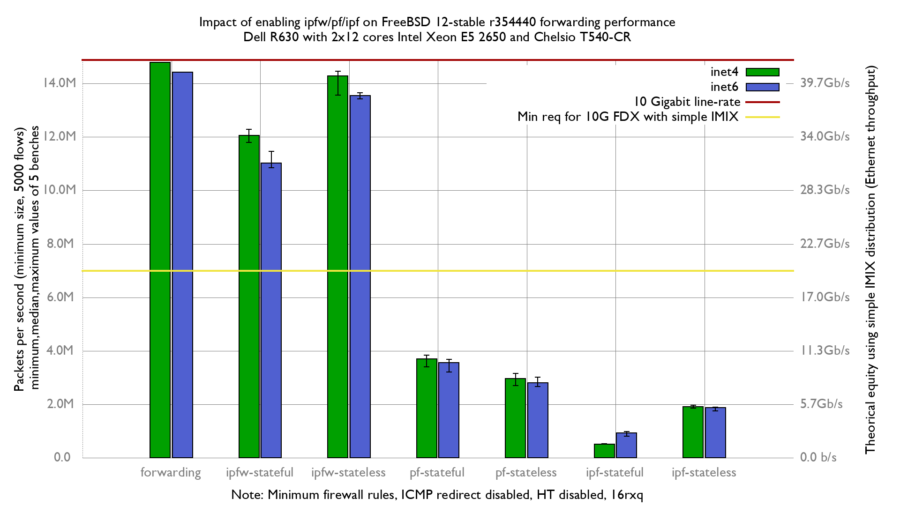

Impact of enabling firewalls on BSDRP 1.96 (12-stable r354440) forwarding performance
  - Dell PowerEdge R630 with 2 Intel E5-2650 v4 2.2Ghz (2x12 cores)
  - Chelsio T520-CR
  - Minimum firewall rules
  - ICMP redirect disabled

