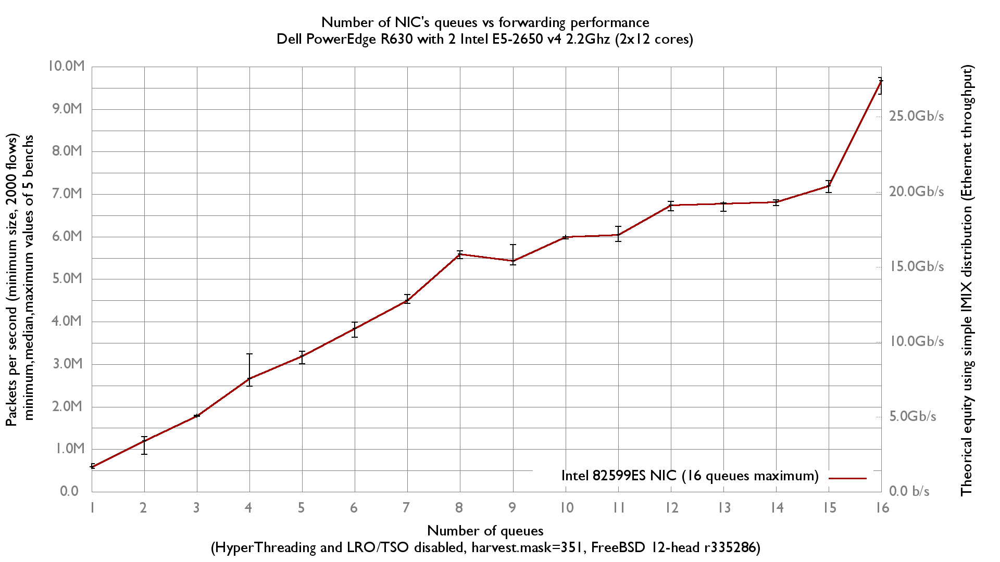

Impact of queues number on forwarding performance
  - Dell PowerEdge R630 with 2 Intel E5-2650 v4 2.2Ghz (2x12 cores)
  - Dual port Intel_82599ES
  - FreeBSD 12 head r335286
  - 5000 flows of smallest UDP packets
  - 2 static routes
  - Traffic load at 14.48 Mpps
  - random.harvest.mask=351

