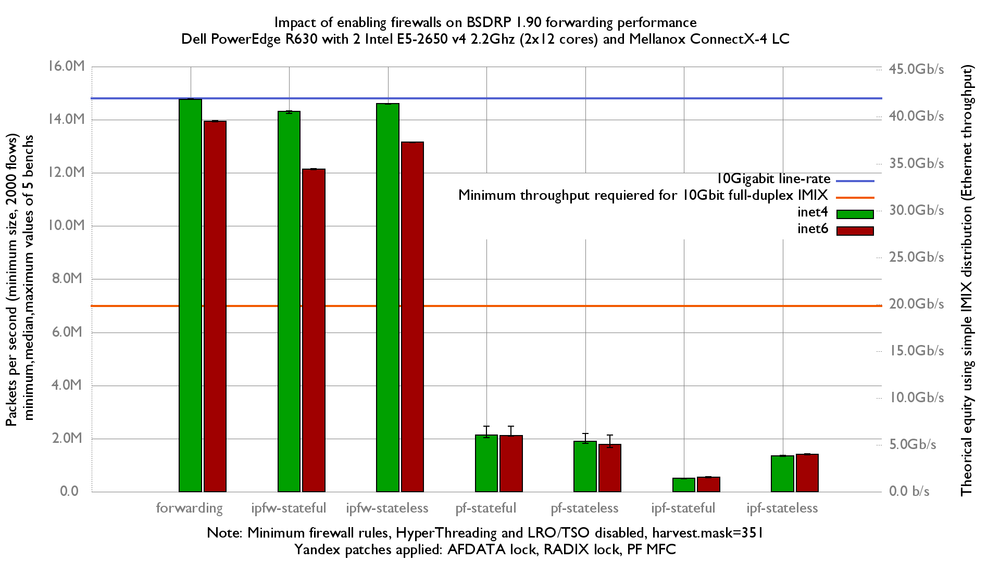

Impact of enabling firewalls on BSDRP 1.90 (FreeBSD 11.2-BETA3) forwarding performance
  - Dell PowerEdge R630 with 2 Intel E5-2650 v4 2.2Ghz (2x12 cores)
  - Mellanox ConnectX-4 LC (10Giga DAC cable)
  - Minimum firewall rules
  - HyperThreading and LRO/TSO disabled
  - harvest.mask=351
  - Yandex patches applied (AFDATA lock, RADIX lock) and pf MFC"

