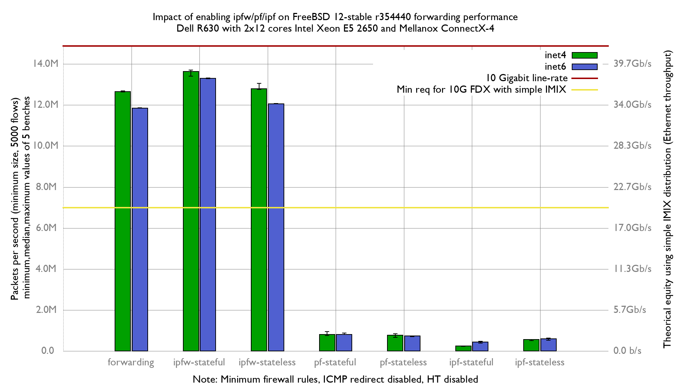

Impact of enabling firewalls on BSDRP 1.96 (FreeBSD 12-stable r354440) forwarding performance
  - Dell PowerEdge R630 with 2 Intel E5-2650 v4 2.2Ghz (2x12 cores)
  - Mellanox ConnectX-4 LC (10Giga DAC cable)
  - Minimum firewall rules
  - HyperThreading and LRO/TSO disabled
  - harvest.mask=351
  - RX & TX queues reduced to 16
  - RX & TX queue size increased to 8192
  - RX & TX coalese usecs increased to 200us
  - RX & TX pkts increased to 1024

