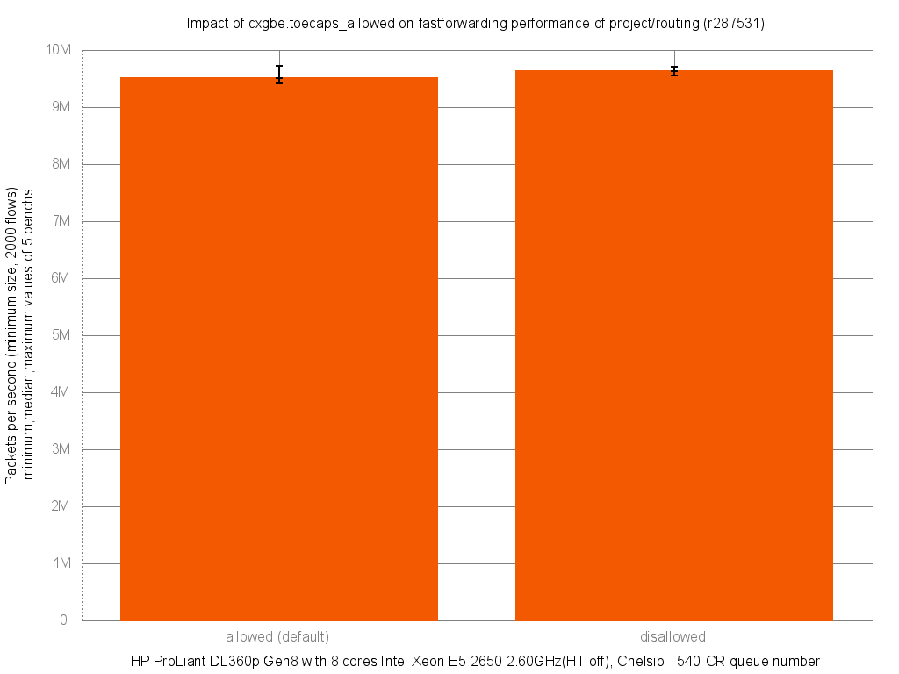

Impact of disabling cxgbe.toecaps_allowed on forwarding performance
  - HP ProLiant DL360p Gen8 with height cores (Intel Xeon E5-2650 @ 2.60GHz)
  - Quad port Chelsio 10-Gigabit T540-CR and OPT SFP (SFP-10G-LR)
  - FreeBSD 10.2
  - 2000 flows of smallest UDP packets
  - 2 firewall rules, 2 static routes
  - ntxq10g and nrxq10g = 4 (and not the default value of ncpu=8)
  - Traffic load at 10Mpps




```
x pps.default_allowed
+ pps.disallowed
+--------------------------------------------------------------------------+
|   x      x              xx       +      +         + +               +   x|
||________________________M_A___________________________|                  |
|                                    |_____________AM___________|          |
+--------------------------------------------------------------------------+
    N           Min           Max        Median           Avg        Stddev
x   5       9412970       9729231       9509645     9522267.6     123871.73
+   5       9551191       9712243       9628587       9623303     61141.884
No difference proven at 95.0% confidence
```
