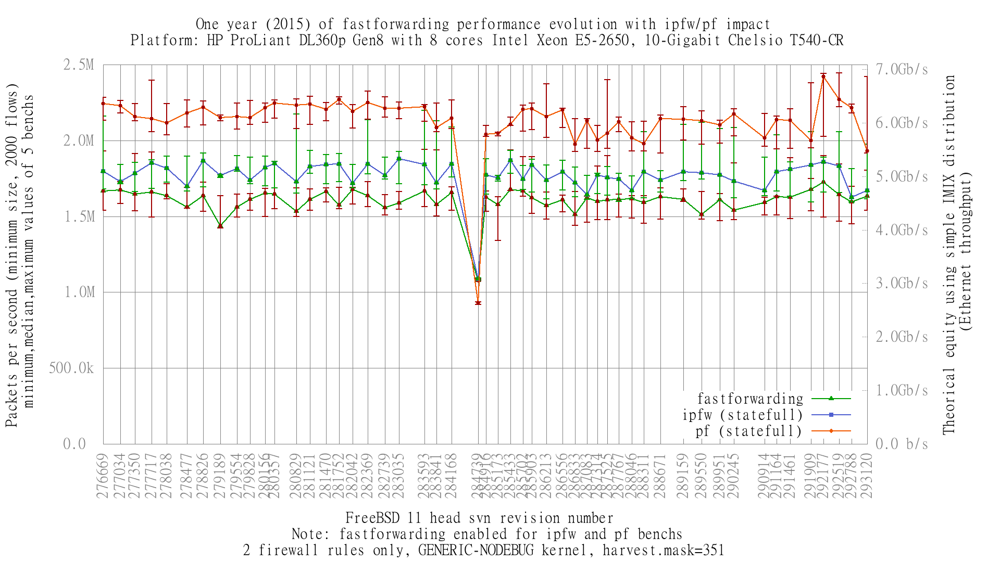

One year (2015) of fastforwarding performance evolution with ipfw/pf impact
  - HP ProLiant DL360p Gen8 with 8 cores Intel Xeon E5-2650
  - 10-Gigabit Chelsio T540-CR
  - FreeBSD 11 head: one revision per week (last of sunday, or last of monday if build failed)
  - 2000 flows of smallest UDP packets
  - Traffic load at 1.448Mpps (Gigabit line-rate)
  - Kernel: GENERIC-NODEBUG
  - harvest.mask=351

