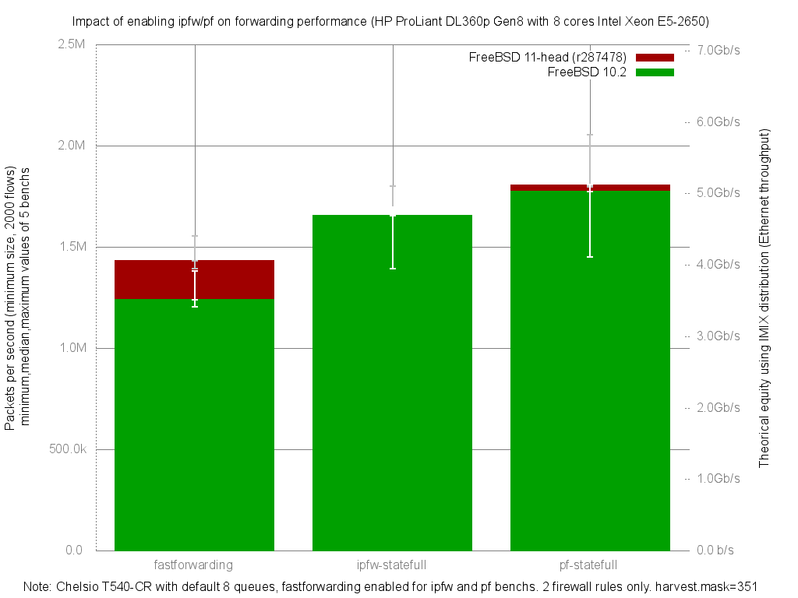

Impact of enabling ipfw or pf on forwarding performance
  - HP ProLiant DL360p Gen8 with height cores (Intel Xeon E5-2650 @ 2.60GHz)
  - Quad port Chelsio 10-Gigabit T540-CR and OPT SFP (SFP-10G-LR)
  - FreeBSD 11-head.r287478
  - 2000 flows of smallest UDP packets
  - 2 firewall rules, 2 static routes
  - ntxq10g and nrxq10g = number of core (default) = 8
  - Traffic load at 10Mpps
  - harvest.mask=351
  - [lab details] (http://bsdrp.net/documentation/examples/forwarding_performance_lab_of_a_hp_proliant_dl360p_gen8_with_10-gigabit_with_10-gigabit_chelsio_t540-cr)




```
x pps.fastforwarding
+ pps.ipfw-statefull
* pps.pf-statefull
+------------------------------------------------------------------------+
|      x          +                          *                           |
| x x  x          +x        +        +       **                *        *|
||_____MA______|                                                         |
|                 |_________MA___________|                               |
|                                         |___M_______A____________|     |
+------------------------------------------------------------------------+
    N           Min           Max        Median           Avg        Stddev
x   5       1392151       1554228       1431387     1443321.4     64456.126
+   5       1543214       1798102       1638398       1649091     111431.77
Difference at 95.0% confidence
        205770 +/- 132757
        14.2567% +/- 9.19801%
        (Student's t, pooled s = 91026.5)
*   5       1796060       2053863       1805603     1884075.6     119285.55
Difference at 95.0% confidence
        440754 +/- 139827
        30.5375% +/- 9.68784%
        (Student's t, pooled s = 95874)
```
