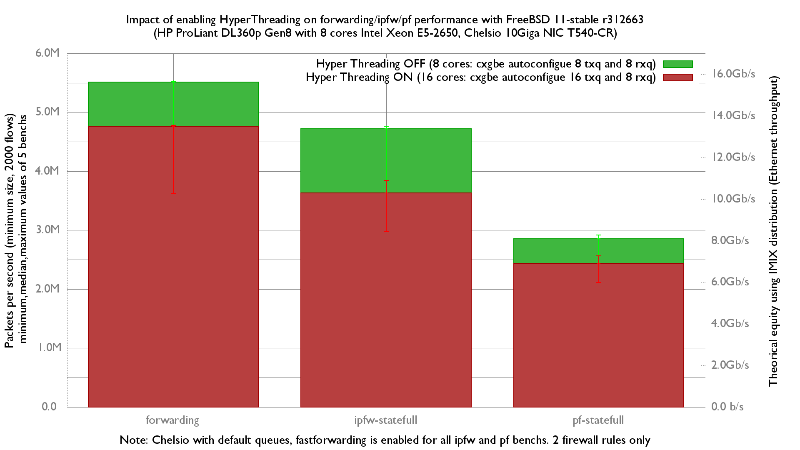

Impact of Hyper Threading on forwarding/ipfw/pf performance
  - HP ProLiant DL360p Gen8 with height cores (Intel Xeon E5-2650 @ 2.60GHz)
  - Quad port Chelsio 10-Gigabit T540-CR and OPT SFP (SFP-10G-LR)
  - FreeBSD 11-stable r312663
  - 2000 flows of smallest UDP packets
  - 2 firewall rules, 2 static routes
  - [lab details] (http://bsdrp.net/documentation/examples/forwarding_performance_lab_of_a_hp_proliant_dl360p_gen8_with_10-gigabit_with_10-gigabit_chelsio_t540-cr)

