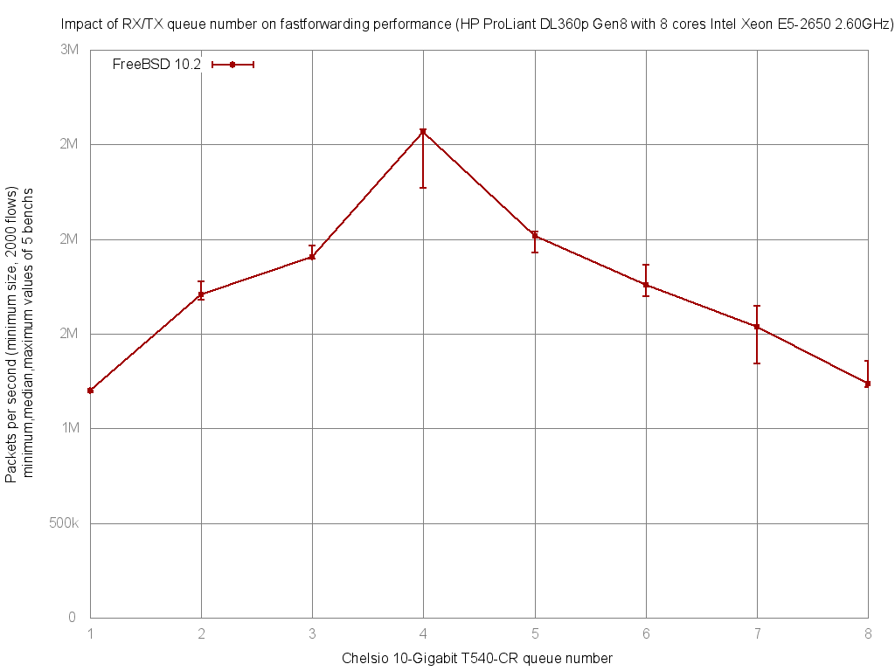

Impact of Chelsio rx/tx queue number on forwarding performance
  - HP ProLiant DL360p Gen8 with height cores (Intel Xeon E5-2650 @ 2.60GHz)
  - Quad port Chelsio 10-Gigabit T540-CR and OPT SFP (SFP-10G-LR).
  - FreeBSD 10.2
  - 2000 flows of smallest UDP packets
  - 2 static routes
  - ntxq10g and nrxq10g = 1, 2, 4 and 8 (=number of core=default on this setup)
  - Traffic load at 10 Mpps




```
x pps.nxq10g=1
+ pps.nxq10g=2
* pps.nxq10g=4
% pps.nxq10g=8
+------------------------------------------------------------------------+
|            %                                                           |
|            %                                                           |
|x%         %%             ++  +                     *  *       *    *  *|
|A                                                                       |
|                          |MA_|                                         |
|                                                     |________AM______| |
|     |____A_M__|                                                        |
+------------------------------------------------------------------------+
    N           Min           Max        Median           Avg        Stddev
x   5       1203038       1207375       1207174     1206370.2     1866.0215
+   5       1713667       1793177       1727996       1747292      37546.26
Difference at 95.0% confidence
	540922 +/- 38768.3
	44.8388% +/- 3.21363%
	(Student's t, pooled s = 26582)
*   5       2207437       2582907       2422546     2398521.2     160881.67
Difference at 95.0% confidence
	1.19215e+06 +/- 165924
	98.8213% +/- 13.754%
	(Student's t, pooled s = 113768)
%   5       1215177       1442279       1437602     1391328.6     98812.665
Difference at 95.0% confidence
	184958 +/- 101921
	15.3318% +/- 8.44858%
	(Student's t, pooled s = 69883.6)
