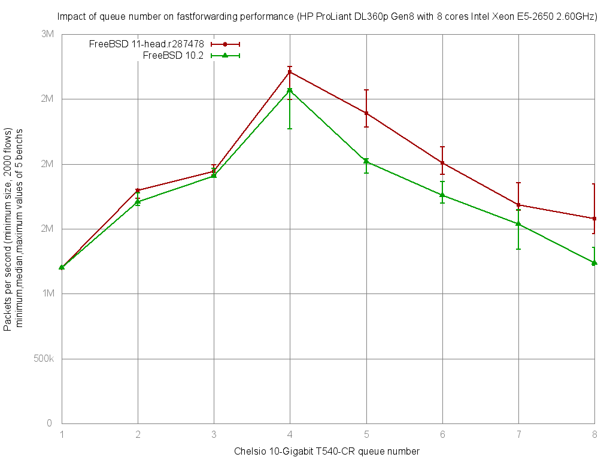

Impact of Chelsio rx/tx queue number on forwarding performance
  - HP ProLiant DL360p Gen8 with height cores (Intel Xeon E5-2650 @ 2.60GHz)
  - Quad port Chelsio 10-Gigabit T540-CR and OPT SFP (SFP-10G-LR).
  - FreeBSD 11-head.r287478
  - 2000 flows of smallest UDP packets
  - 2 static routes
  - ntxq10g and nrxq10g = 1, 2, 4 and 8 (=number of core=default on this setup)
  - Traffic load at 10 Mpps




```
x pps.1
+ pps.2
* pps.4
% pps.8
+--------------------------------------------------------------------------+
|             %                                                            |
|             %                                                            |
|x           %%    %     + +++                                      ** * **|
|A                                                                         |
|                         |AM|                                             |
|                                                                    |_A__||
|           |_MA_|                                                         |
+--------------------------------------------------------------------------+
    N           Min           Max        Median           Avg        Stddev
x   5       1199580       1208705       1206409     1204460.8     4317.7277
+   5       1711850       1783741       1766664     1755268.6     29252.046
Difference at 95.0% confidence
	550808 +/- 30493.7
	45.7307% +/- 2.53173%
	(Student's t, pooled s = 20908.4)
*   5       2618577       2738640       2681001       2677972     51482.446
Difference at 95.0% confidence
	1.47351e+06 +/- 53278.9
	122.338% +/- 4.42347%
	(Student's t, pooled s = 36531.4)
%   5       1459938       1587661       1475681     1494382.2     52925.928
Difference at 95.0% confidence
	289921 +/- 54762.5
	24.0706% +/- 4.54664%
	(Student's t, pooled s = 37548.6)
```
