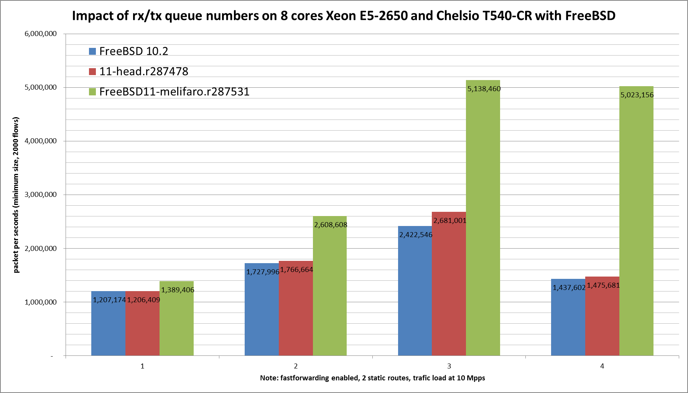

Impact of Chelsio rx/tx queue number on forwarding performance
  - HP ProLiant DL360p Gen8 with height cores (Intel Xeon E5-2650 @ 2.60GHz)
  - Quad port Chelsio 10-Gigabit T540-CR and OPT SFP (SFP-10G-LR).
  - FreeBSD 11-melifaro.r287531
  - 2000 flows of smallest UDP packets
  - 2 static routes
  - ntxq10g and nrxq10g = 1, 2, 4 and 8 (=number of core=default on this setup)
  - Traffic load at 10 Mpps




```
x pps.one
+ pps.two
* pps.four
% pps.height
+--------------------------------------------------------------------------+
|x                      ++                                              %* |
|x                      ++                                          % %%%**|
|A                                                                         |
|                       |A                                                 |
|                                                                        A||
|                                                                    |_A|  |
+--------------------------------------------------------------------------+
    N           Min           Max        Median           Avg        Stddev
x   5       1385806       1390321       1389406       1388580      2026.049
+   5       2599947       2636412       2608608     2615089.6     16890.043
Difference at 95.0% confidence
	1.22651e+06 +/- 17543.1
	88.3283% +/- 1.26339%
	(Student's t, pooled s = 12028.7)
*   5       5121533       5176335       5138460     5141967.4     20578.883
Difference at 95.0% confidence
	3.75339e+06 +/- 21325.1
	270.304% +/- 1.53575%
	(Student's t, pooled s = 14621.8)
%   5       4863601       5076873       5023156     5003705.6     87010.068
Difference at 95.0% confidence
	3.61513e+06 +/- 89755.6
	260.347% +/- 6.46384%
	(Student's t, pooled s = 61542.1)
```
