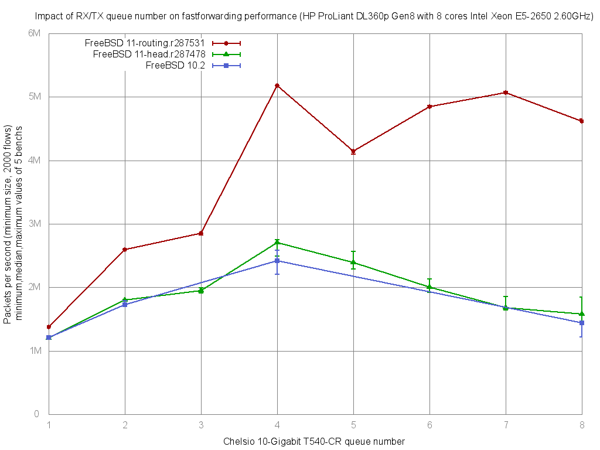

Impact of Chelsio rx/tx queue number on forwarding performance
  - HP ProLiant DL360p Gen8 with eight cores (Intel Xeon E5-2650 @ 2.60GHz)
  - Quad port Chelsio 10-Gigabit T540-CR and OPT SFP (SFP-10G-LR).
  - FreeBSD 11-routing.r287531
  - 2000 flows of smallest UDP packets
  - 2 static routes
  - ntxq10g and nrxq10g = 1, 2, 3, 4, 5, 6, 7 and 8 (=number of core=default on this setup)
  - Traffic load at 10 Mpps




```
x pps.1
+ pps.2
* pps.4
% pps.5
# pps.6
@ pps.7
O pps.8
+------------------------------------------------------------------------+
|x                      +                            %       O    #   @ *|
|x                      +                            %       OO   #   @ *|
|x                      +                           %%       OO   #   @ *|
|A                                                                       |
|                       A                                                |
|                                                                       A|
|                                                   |A                   |
|                                                                 A      |
|                                                                     A  |
|                                                            MA          |
+------------------------------------------------------------------------+
    N           Min           Max        Median           Avg        Stddev
x   5       1377455       1383022       1379151     1379556.8     2314.5813
+   5       2595949       2602639       2596119     2598418.2      3278.071
Difference at 95.0% confidence
	1.21886e+06 +/- 4138.36
	88.3517% +/- 0.299977%
	(Student's t, pooled s = 2837.52)
*   5       5175726       5182681       5176184       5178420     3473.5147
Difference at 95.0% confidence
	3.79886e+06 +/- 4304.58
	275.368% +/- 0.312026%
	(Student's t, pooled s = 2951.49)
%   5       4100429       4151366       4147113     4138338.4     21429.499
Difference at 95.0% confidence
	2.75878e+06 +/- 22228.2
	199.976% +/- 1.61126%
	(Student's t, pooled s = 15241.1)
#   5       4840081       4863335       4845846     4849387.4     9102.4346
Difference at 95.0% confidence
	3.46983e+06 +/- 9685.84
	251.518% +/- 0.702098%
	(Student's t, pooled s = 6641.22)
@   5       5066231       5087295       5070751     5075040.4     9671.3023
Difference at 95.0% confidence
	3.69548e+06 +/- 10255.4
	267.875% +/- 0.743385%
	(Student's t, pooled s = 7031.76)
O   5       4611262       4649438       4614369     4622181.8     15828.602
Difference at 95.0% confidence
	3.24262e+06 +/- 16497.2
	235.048% +/- 1.19584%
	(Student's t, pooled s = 11311.5)
```
