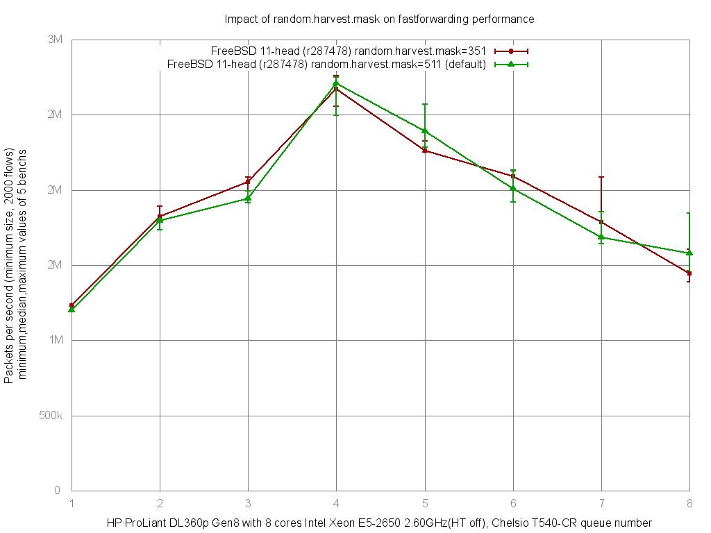

Impact of random.harvest.mask and Chelsio rx/tx queue number on fastforwarding performance
  - HP ProLiant DL360p Gen8 with eight cores (Intel Xeon E5-2650 @ 2.60GHz)
  - Quad port Chelsio 10-Gigabit T540-CR and OPT SFP (SFP-10G-LR)
  - FreeBSD 11-head.r287478
  - 2000 flows of smallest UDP packets
  - 2 static routes
  - ntxq10g and nrxq10g = 1, 2, 3, 4, 5, 6, 7 and 8 (=number of core=default on this setup)
  - Traffic load at 10 Mpps




```
x pps.1
+ pps.2
* pps.3
% pps.4
# pps.5
@ pps.6
O pps.8
+------------------------------------------------------------------------+
|xx      OO O     OO        ++ ++@   * O*O@@     # ##          %%   %%  %|
||A                                                                      |
|                           |MA|                                         |
|                                     |A_|                               |
|                                                              |___AM__| |
|                                               |MA|                     |
|                                   |___AM_|                             |
|        |__M_A___|                                                      |
+------------------------------------------------------------------------+
    N           Min           Max        Median           Avg        Stddev
x   5       1211803       1233431       1233048     1225772.2     10480.656
+   5       1793661       1892379       1823093     1834791.6     42519.879
Difference at 95.0% confidence
	609019 +/- 45162.1
	49.6845% +/- 3.68438%
	(Student's t, pooled s = 30966)
*   5       1994998       2086056       2051622     2045747.6     34656.922
Difference at 95.0% confidence
	819975 +/- 37339.4
	66.8946% +/- 3.04619%
	(Student's t, pooled s = 25602.2)
%   5       2558251       2761570       2674330       2654490     80681.386
Difference at 95.0% confidence
	1.42872e+06 +/- 83903.7
	116.557% +/- 6.84497%
	(Student's t, pooled s = 57529.7)
#   5       2251921       2324739       2262573       2277994     30618.299
Difference at 95.0% confidence
	1.05222e+06 +/- 33374.5
	85.8415% +/- 2.72273%
	(Student's t, pooled s = 22883.7)
@   5       1919737       2129101       2090141     2055231.6     82180.501
Difference at 95.0% confidence
	829459 +/- 85437.1
	67.6683% +/- 6.97006%
	(Student's t, pooled s = 58581.1)
O   5       1391019       1604836       1444233     1487371.8     101933.31
Difference at 95.0% confidence
	261600 +/- 105675
	21.3416% +/- 8.62113%
	(Student's t, pooled s = 72457.7)
```
