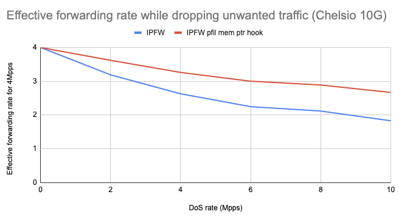

Impact of DDoS on forwarding 4Mpps traffic
  - SuperMicro X9SRL-F (10 cores Intel Xeon E5-2650L V2 @ 1.70GHz)
  - Quad port Chelsio 10-Gigabit T540-CR and 10G Base-LR (LC) SFP
  - FreeBSD 13.0-CURRENT r357572

