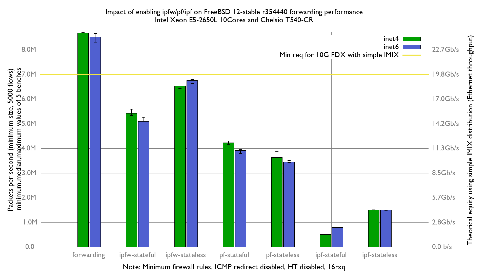

Impact of enabling ipfw/pf/ipf on forwarding performance
  - SuperMicro X9SRL-F (10 cores Intel Xeon E5-2650L V2 @ 1.70GHz)
  - Quad port Chelsio 10-Gigabit T540-CR and 10G Base-LR (LC) SFP
  - FreeBSD 12-stable r354440 (BSDRP 1.96)
  - 5000 flows of smallest UDP packets
  - 2 firewall rules, 2 static routes
  - harvest.mask=351
  - ICMP redirect disabled

