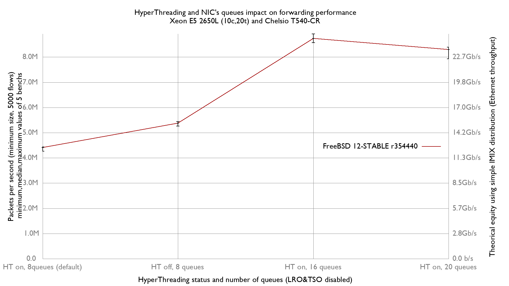

HyperThreading status and number of NIC's queues vs forwarding performance
  - Intel(R) Xeon(R) CPU E5-2650L v2 @ 1.70GHz (10c, 20t)
  - Chelsio T540-CR
  - FreeBSD 12-stable r354440 (BSDRP.1.96)




```
x HT on, 8q (default): inet4 packets-per-second forwarded
+ HT off, 8q: inet4 packets-per-second forwarded
* HT on, 16q: inet4 packets-per-second forwarded
+--------------------------------------------------------------------------+
|x x              ++                                                   *  *|
|x xx            +++                                                 * *  *|
||AM|            |A_|                                                |_MA_||
+--------------------------------------------------------------------------+
    N           Min           Max        Median           Avg        Stddev
x   5       4265579     4433699.5     4409249.5     4359580.3       81559.4
+   5       5257621       5443012       5372493     5372693.5     73316.243
Difference at 95.0% confidence
	1.01311e+06 +/- 113098
	23.2388% +/- 2.94299%
	(Student's t, pooled s = 77547.4)
*   5       8566972       8917315     8734750.5     8769616.1     147186.74
Difference at 95.0% confidence
	4.41004e+06 +/- 173536
	101.157% +/- 5.21388%
	(Student's t, pooled s = 118987)
```
