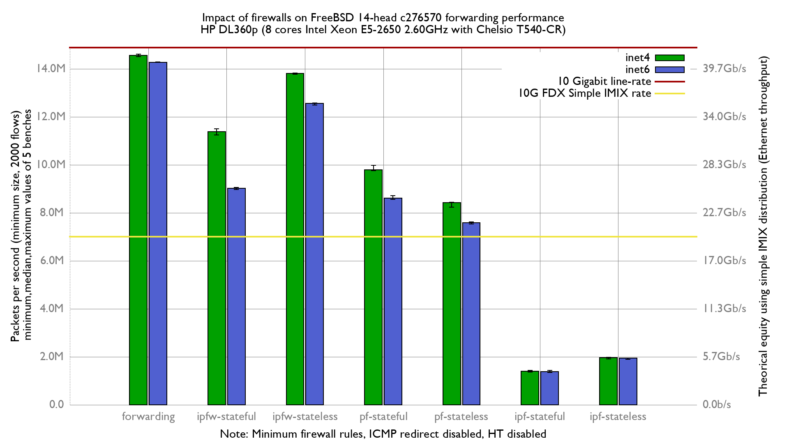

Impact of enabling firewalls on forwarding performance
  - HP ProLiant DL360p Gen8 with 8 cores (Intel Xeon E5-2650 @ 2.60GHz)
  - Quad port Chelsio 10-Gigabit T540-CR and OPT SFP (SFP-10G-LR).
  - FreeBSD 14-head c276570 (BSDRP 1.991)
  - 2000 flows of smallest UDP packets
  - 2 firewall rules, 2 static routes
  - harvest.mask=351
  - ICMP redirect disabled

