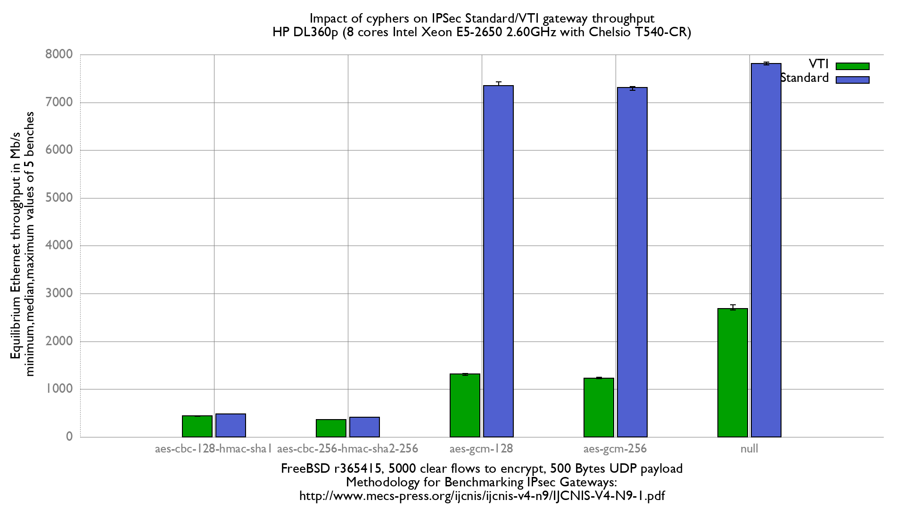

Impact of cyphers on IPsec VTI performance
  - HP ProLiant DL360p Gen8 with 8 cores (Intel Xeon E5-2650 @ 2.60GHz)
  - Quad port Chelsio 10-Gigabit T540-CR and OPT SFP (SFP-10G-LR).
  - FreeBSD 13-head r365873
  - if_ipsec (VTI) mode
  - 5000 flows of clear UDP packets
  - dev.igb.*.iflib.tx_abdicate=1
  - 500Bytes UDP load => packet size: 528B => Ethernet frame size:542B



Difference without VTI mode:
```
x null cypher, standard mode: Mb/s
+ null cypher, VTI mode: Mb/s
+--------------------------------------------------------------------------+
|+                                                                        x|
|+                                                                        x|
|+++                                                                     xx|
|                                                                        |A|
|MA                                                                        |
+--------------------------------------------------------------------------+
    N           Min           Max        Median           Avg        Stddev
x   5          7787          7838          7809        7811.6     18.433665
+   5          2661          2763          2683        2695.8     39.512023
Difference at 95.0% confidence
	-5115.8 +/- 44.964
	-65.4898% +/- 0.528349%
	(Student's t, pooled s = 30.8302)
```

[FlameGraph with null cypher](flamegraph.svg)
