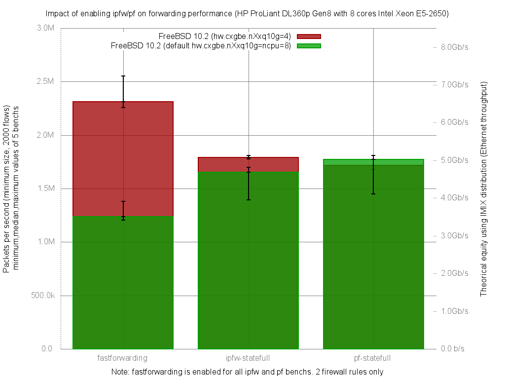

Impact of enabling ipfw or pf on forwarding performance
  - HP ProLiant DL360p Gen8 with height cores (Intel Xeon E5-2650 @ 2.60GHz)
  - Quad port Chelsio 10-Gigabit T540-CR and OPT SFP (SFP-10G-LR).
  - FreeBSD 10.2
  - 2000 flows of smallest UDP packets
  - 2 firewall rules, 2 static routes
  - ntxq10g and nrxq10g = 4 (and not the default value of ncpu=8)
  - Traffic load at 10Mpps




```
x pps.fastforwarding
+ pps.ipfw-statefull
* pps.pf-statefull
+------------------------------------------------------------------------+
|   *                                                                    |
|*  *     +                                     x                        |
|*  *    ++++                                   x   x x                 x|
|                                            |______M__A_________|       |
|        |A|                                                             |
||_AM                                                                    |
+------------------------------------------------------------------------+
    N           Min           Max        Median           Avg        Stddev
x   5       2258965       2553360       2312089     2342101.6      121840.6
+   5       1775671       1809822       1788475     1792371.6     14091.412
Difference at 95.0% confidence
	-549730 +/- 126489
	-23.4717% +/- 5.40065%
	(Student's t, pooled s = 86728.6)
*   5       1678010       1716103       1714692     1701638.8     19028.929
Difference at 95.0% confidence
	-640463 +/- 127174
	-27.3456% +/- 5.42992%
	(Student's t, pooled s = 87198.7)
```
