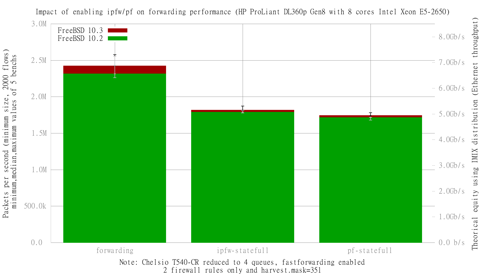

Impact of enabling ipfw or pf on forwarding performance
  - HP ProLiant DL360p Gen8 with height cores (Intel Xeon E5-2650 @ 2.60GHz)
  - Quad port Chelsio 10-Gigabit T540-CR and OPT SFP (SFP-10G-LR).
  - FreeBSD 10.3
  - 2000 flows of smallest UDP packets
  - 2 firewall rules, 2 static routes
  - ntxq10g and nrxq10g = 4 (and not the default value of ncpu=8)
  - Traffic load at 10Mpps




```
x pps.forwarding
+ pps.ipfw-statefull
* pps.pf-statefull
+--------------------------------------------------------------------------+
|       * +  +                                               x             |
|*** ******+++ +++                        xxx    x           x x        xxx|
|                                            |____________A__M_________|   |
|         |__A_|                                                           |
|  |__AM_|                                                                 |
+--------------------------------------------------------------------------+
    N           Min           Max        Median           Avg        Stddev
x  10       2183749       2576115       2420803       2381829     158758.74
+  10       1778657     1870703.5     1815814.5     1817354.4     31446.622
Difference at 95.0% confidence
        -564475 +/- 107528
        -23.6992% +/- 4.5145%
        (Student's t, pooled s = 114440)
*  10     1672297.5       1779725     1741437.8     1732491.1     38102.023
Difference at 95.0% confidence
        -649338 +/- 108474
        -27.2622% +/- 4.55422%
        (Student's t, pooled s = 115447)
```
