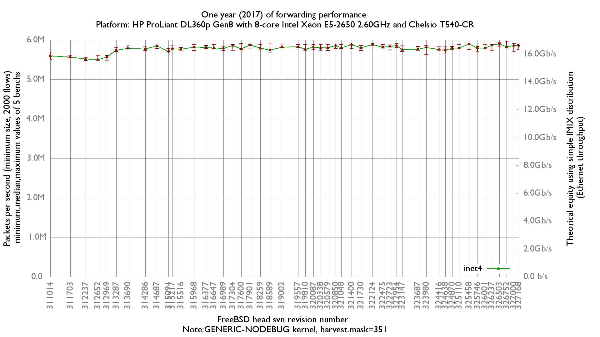

Evolution of forwarding performance during 2017
  - HP ProLiant DL360p Gen8 with height cores (Intel Xeon E5-2650 @ 2.60GHz)
  - Quad port Chelsio 10-Gigabit T540-CR and OPT SFP (SFP-10G-LR)
  - FreeBSD -head
  - 2000 flows of smallest UDP packets
  - 2 static routes
  - harvest.mask=351

