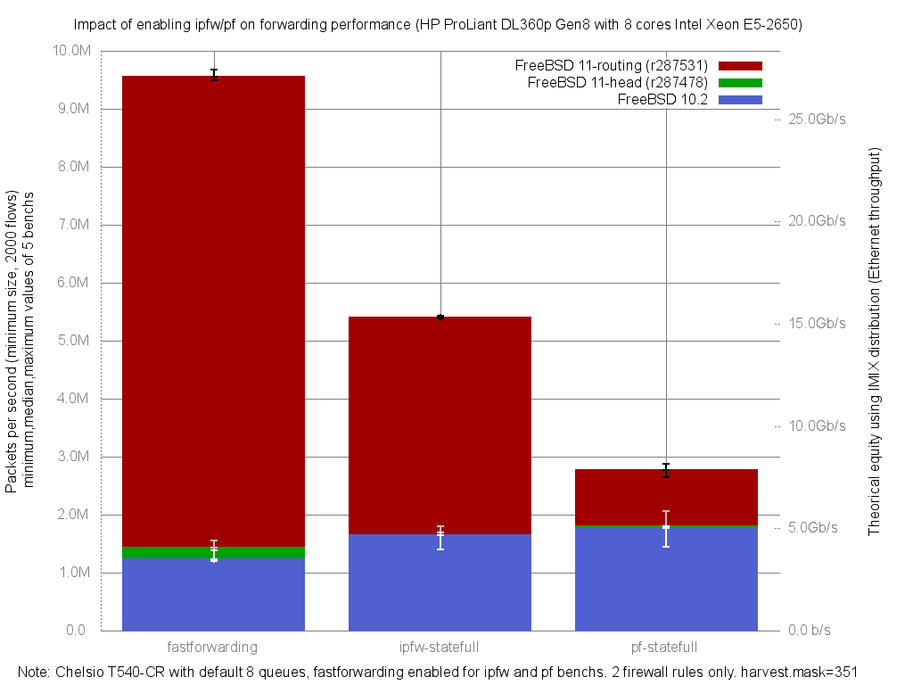

Impact of enabling ipfw or pf on forwarding performance
  - HP ProLiant DL360p Gen8 with height cores (Intel Xeon E5-2650 @ 2.60GHz)
  - Quad port Chelsio 10-Gigabit T540-CR and OPT SFP (SFP-10G-LR)
  - FreeBSD routing r287531
  - 2000 flows of smallest UDP packets
  - 2 firewall rules, 2 static routes
  - ntxq10g and nrxq10g = number of core (default) = 8
  - Traffic load at 10Mpps
  - harvest.mask=351
  - [lab details] (http://bsdrp.net/documentation/examples/forwarding_performance_lab_of_a_hp_proliant_dl360p_gen8_with_10-gigabit_with_10-gigabit_chelsio_t540-cr)




```
x pps.fastforwarding
+ pps.ipfw-statefull
* pps.pf-statefull
+------------------------------------------------------------------------+
| **                         +                                        xx |
|***                         +                                        xxx|
|                                                                     |A||
|                            A                                           |
||A|                                                                     |
+------------------------------------------------------------------------+
    N           Min           Max        Median           Avg        Stddev
x   5       9491096       9676484       9548168     9561675.6     76493.225
+   5       5388639       5428977       5400641     5404514.4     15172.549
Difference at 95.0% confidence
        -4.15716e+06 +/- 80422.4
        -43.4773% +/- 0.841091%
        (Student's t, pooled s = 55142.6)
*   5       2646698       2877442       2766695     2782001.6     94126.596
Difference at 95.0% confidence
        -6.77967e+06 +/- 125082
        -70.9047% +/- 1.30816%
        (Student's t, pooled s = 85764.3)

```
