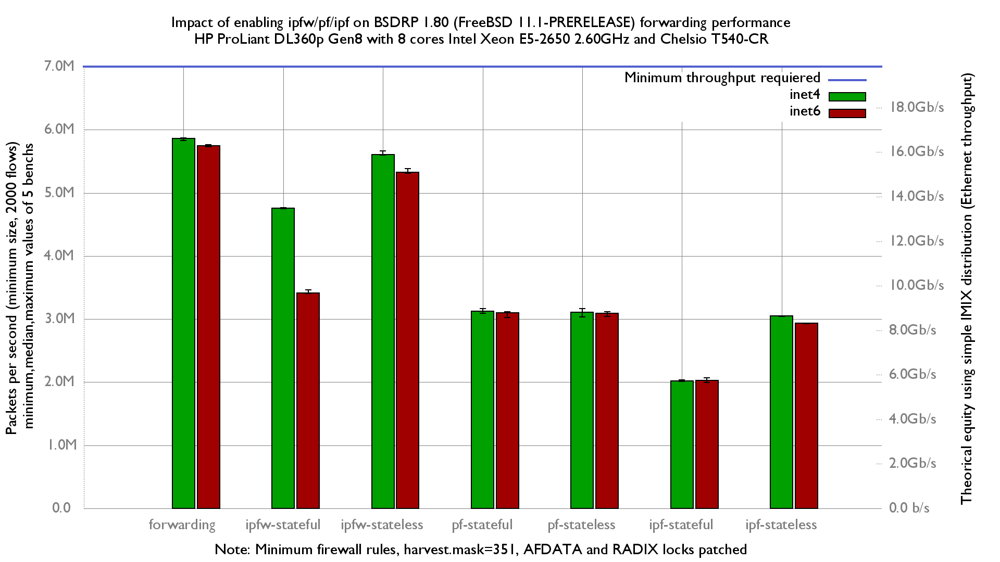

Impact of enabling ipfw/pf/ipf on forwarding performance
  - HP ProLiant DL360p Gen8 with height cores (Intel Xeon E5-2650 @ 2.60GHz)
  - Quad port Chelsio 10-Gigabit T540-CR and OPT SFP (SFP-10G-LR).
  - FreeBSD 11.1-PRERELEASE (BSDRP 1.80)
  - 2000 flows of smallest UDP packets
  - 2 firewall rules, 2 static routes
  - harvest.mask=351

