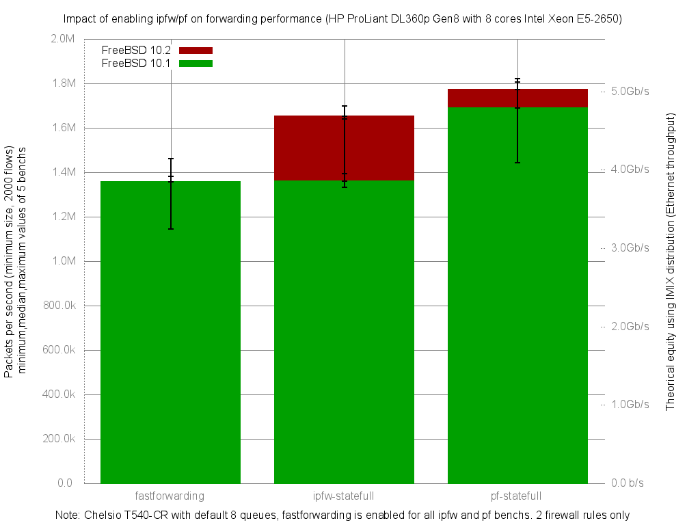

Impact of enabling ipfw or pf on forwarding performance
  - HP ProLiant DL360p Gen8 with height cores (Intel Xeon E5-2650 @ 2.60GHz)
  - Quad port Chelsio 10-Gigabit T540-CR and OPT SFP (SFP-10G-LR).
  - FreeBSD 10.2
  - 2000 flows of smallest UDP packets
  - 2 firewall rules, 2 static routes
  - ntxq10g and nrxq10g = number of core (default) = 8
  - Traffic load at 10Mpps
  - [lab details] (http://bsdrp.net/documentation/examples/forwarding_performance_lab_of_a_hp_proliant_dl360p_gen8_with_10-gigabit_with_10-gigabit_chelsio_t540-cr)




```
x pps.fastforwarding
+ pps.ipfw-statefull
* pps.pf-statefull
+------------------------------------------------------------------------+
|  x xx              x +     *                    +   ++   *   * **      |
||____M_A_______|                                                        |
|                       |________________A________M______|               |
|                                        |______________A______M________||
+------------------------------------------------------------------------+
    N           Min           Max        Median           Avg        Stddev
x   5       1205008       1380864       1237335     1258061.2     69965.958
+   5       1392513       1697192       1652812     1565466.4     157870.29
Difference at 95.0% confidence
	307405 +/- 178080
	24.4348% +/- 14.1551%
	(Student's t, pooled s = 122103)
*   5       1450320       1807207       1772617     1713154.4     149069.65
Difference at 95.0% confidence
	455093 +/- 169822
	36.1742% +/- 13.4987%
	(Student's t, pooled s = 116441)
```
