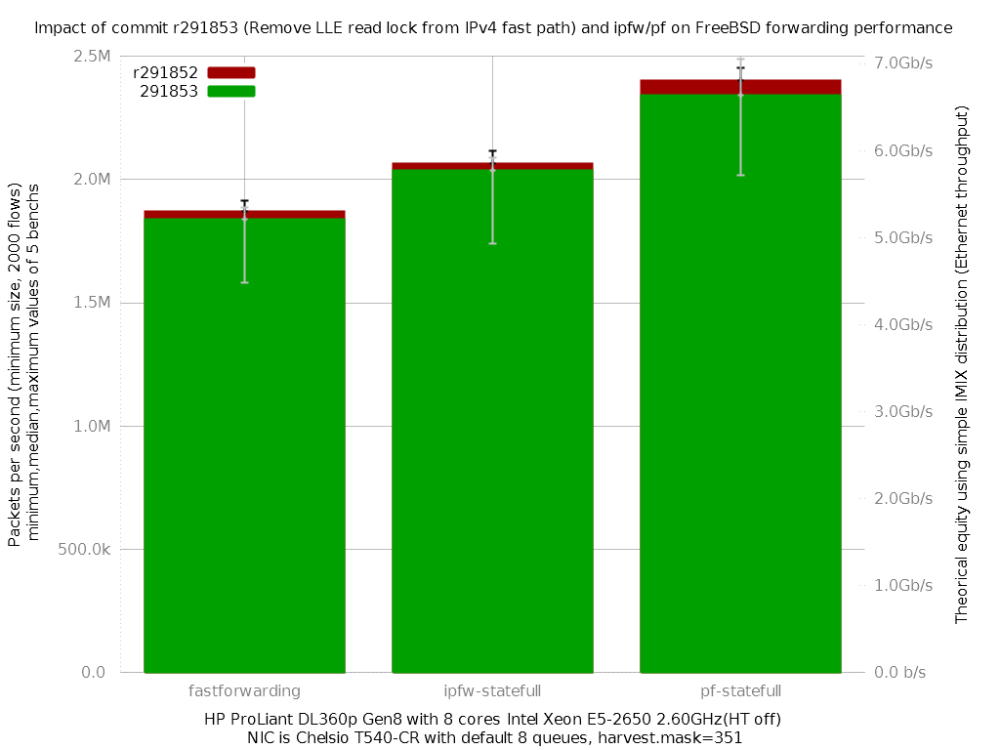

Impact of commit r291853 (Remove LLE read lock from IPv4 fast path) and ipfw/pf on FreeBSD forwarding performance
  - HP ProLiant DL360p Gen8 with height cores (Intel Xeon E5-2650 @ 2.60GHz)
  - Quad port Chelsio 10-Gigabit T540-CR and OPT SFP (SFP-10G-LR)
  - FreeBSD 11-head r291853
  - 2000 flows of smallest UDP packets
  - 2 firewall rules, 2 static routes
  - ntxq10g and nrxq10g = number of core (default) = 8
  - Traffic load at 10Mpps
  - harvest.mask=351
  - [lab details] (http://bsdrp.net/documentation/examples/forwarding_performance_lab_of_a_hp_proliant_dl360p_gen8_with_10-gigabit_with_10-gigabit_chelsio_t540-cr)

