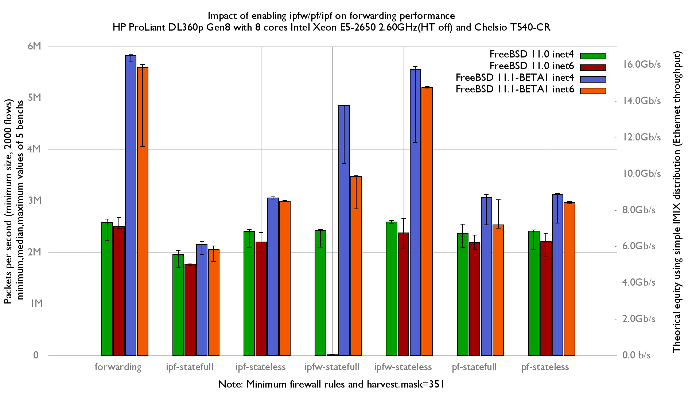

Impact of ipfw/ipf/pf on forwarding performance on fbsd 11.0 and 11.1-BETA1
  - HP ProLiant DL360p Gen8 with height cores (Intel Xeon E5-2650 @ 2.60GHz)
  - Quad port Chelsio 10-Gigabit T540-CR and OPT SFP (SFP-10G-LR).
  - FreeBSD 11.0 and 11.1-BETA1
  - 2000 flows of smallest UDP packets
  - 2 static routes
  - Traffic load at 14.88 Mpps



flame graphs generated with this command:
```
stackcollapse-pmc.pl bench.312905.1.pmc.graph | flamegraph.pl > bench.312905.svg

```
